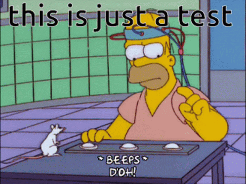

Here is an example of headings. You can use this heading by the following markdown rules. For example: use `#` for heading 1 and use `######` for heading 6.

Do not use `#` (heading 1) in articles.

## Heading 2

### Heading 3

#### Heading 4

##### Heading 5

###### Heading 6

---

### Emphasis

The emphasis, aka italics, with _asterisks_ or _underscores_.

Strong emphasis, aka bold, with **asterisks** or **underscores**.

The combined emphasis with **asterisks and _underscores_**.

Strike through uses two tildes. ~~Scratch this.~~

---


### Link

[I'm an inline-style link](https://www.google.com)

[I'm an inline-style link with title](https://www.google.com "Google's Homepage")

[I'm a reference-style link][Arbitrary case-insensitive reference text]

[I'm a relative reference to a repository file](../../2016/2016-05-02-en-coverage-metric/index.md)

[You can use numbers for reference-style link definitions][1]

Or leave it empty and use the [link text itself].

URLs and URLs in angle brackets will automatically get turned into links.
<http://www.example.com> or <http://www.example.com> and sometimes
example.com (but not on Github, for example).

Some text to show that the reference links can follow later.

[arbitrary case-insensitive reference text]: https://www.themefisher.com
[1]: https://gethugothemes.com
[link text itself]: https://www.getjekyllthemes.com

---

### Paragraph

Lorem ipsum dolor sit amet consectetur adipisicing elit. Quam nihil enim maxime corporis cumque totam aliquid nam sint inventore optio modi neque laborum officiis necessitatibus, facilis placeat pariatur! Voluptatem, sed harum pariatur adipisci voluptates voluptatum cumque, porro sint minima similique magni perferendis fuga! Optio vel ipsum excepturi tempore reiciendis id quidem? Vel in, doloribus debitis nesciunt fugit sequi magnam accusantium modi neque quis, vitae velit, pariatur harum autem a! Velit impedit atque maiores animi possimus asperiores natus repellendus excepturi sint architecto eligendi non, omnis nihil. Facilis, doloremque illum. Fugit optio laborum minus debitis natus illo perspiciatis corporis voluptatum rerum laboriosam.

---

### Lists

Ordered:

1. List item
    1. List item
        1. List item
        2. List item
    2. List item
        - List item
        - List item
2. List item
    - List item
    - List item
3. List item
4. List item
5. List item

Unordered:

- List item
    - List item
    - List item
        - List item
        - List item
- List item
    1. List item
    2. List item
- List item
- List item
- List item

Next list:
1. List item
2. List item

---

### Admonitions


This is a simple warning.

With _some_ lists and [link A](https://google.com) and [link B](../test):

- a
- b

1. a
2. b



This is a simple note with [link A](https://google.com) and [link B](../test).



This is a _simple_ cta.



### Native admonitions

> [!warning]
> This is a simple warning.
> 
> With _some_ lists and [link A](https://google.com) and [link B](../test):
> 
> - a
> - b
> 
> 1. a
> 2. b

> [!note]
> This is a simple note with [link A](https://google.com) and [link B](../test).

> [!info]
> Test info.

> [!cta]
> Test cta.


---

### Code and `Code` Highlighting

This is an `Inline code` sample. And some  or 

```javascript
var s = "JavaScript syntax highlighting";
alert(s);
```

```python
s = "Python syntax highlighting"
print s
```

---

### Blockquote

> Did you come here for something in particular or just general Riker-bashing? And blowing into maximum warp speed, you appeared for an instant to be in two places at once.

---

### Tables

| Tables        |      Are      |  Cool |
| ------------- | :-----------: | ----: |
| col 3 is      | right-aligned | $1600 |
| col 2 is      |   centered    |   $12 |
| zebra stripes |   are neat    |    $1 |

---

### Image




---

### Youtube video



---

### Gist




### Tabs

{}
{}
```http
GET /getMessages HTTP/2
```
{}

{}
```http
HTTP/2 200 OK
Date: Fri, 07 Mar 2025 22:01:08 GMT
```
{}

{}


{}

{}
This is a tabbed text.
 
> With _some_ lists and [link A](https://google.com) and [link B](../test):

- a
- b
 
1. a
2. b
{}
{}