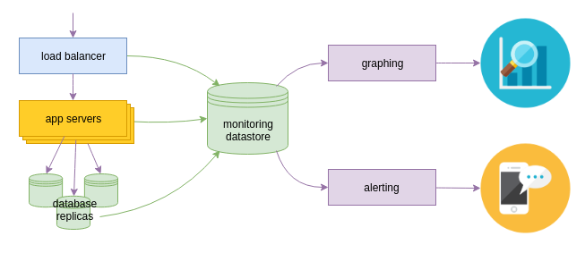

I love MOOCs: Coursera, Udacity, Stepic. There are so many courses to watch for entire life. Just now watched a course [Intro to DevOps](https://www.udacity.com/course/intro-to-devops--ud611) by Udacity.

The course is concise and comprehensive. Here are some notes I've made.

---

## DevOps 
*DevOps* is the practice of operations and development engineers participating together in the entire service life-cycle, from design through the development process to production support.

DevOps is also characterized by operations staff making use many of the same techniques as developers for their systems work.

CommitStrip --- [what DevOps is *not*](http://www.commitstrip.com/en/2015/02/02/is-your-company-ready-for-devops/)

Components that make up DevOps --- CAMS:

* Communication --- agile communications, lean, respect
* Automation --- deployment, testing, integration
* Measurement --- monitoring, useful logs, biz metrics, usefulness of tools & processes
* Sharing --- shared view of goals, problems, and benefits

> If you can't measure it, you can't improve it.

## Solving the environment problem

1. Golden image
    * more work up front --- large install image must be regenerated for any change
    * much faster installation/boot
2. Configuration management
    * lighter build process --- integration is done at install/initial boot time
    * slower start up process
3. Combination of 1 & 2

## Monitoring

Monitoring data sources:

* external probing, test queries
* application levels stats (queries per second, latency)
* environment stats (JVM memory profile)
* host/container stats (load average, disk errors)

Monitoring data products:

* alerting
* performance analysis
* capacity prediction
* growth measurement
* debugging metrics

## Additional resources

### Notable books

* [The Phoenix Project](http://itrevolution.com/books/phoenix-project-devops-book/) (by Gene Kim, Kevin Behr, George Spafford) --- a novel about IT, DevOps, and helping your business win
* [Continuous Delivery: Reliable Software Releases through Build, Test, and Deployment Automation](http://www.amazon.com/Continuous-Delivery-Deployment-Automation-Addison-Wesley-ebook/dp/B003YMNVC0) (by Jez Humble, David Farley) --- the principles and technical practices that enable rapid, incremental delivery of high quality, valuable new functionality to users
* [Lean Enterprise: How High Performance Organizations Innovate at Scale](http://www.amazon.com/Lean-Enterprise-Performance-Organizations-Innovate/dp/1449368425) (by Jez Humble, Joanne Molesky, Barry O'Reilly) --- Lean and Agile principles and patterns to help you move fast at scale --- and demonstrates why and how to apply these methodologies throughout your organization, rather than with just one department or team
* [Building a DevOps Culture](http://smile.amazon.com/gp/product/B00CBM1WFC) (by Mandi Walls) --- free Kindle book --- DevOps is as much about culture as it is about tools

### Notable presentations

* [Short history of DevOps](https://www.youtube.com/watch?v=o7-IuYS0iSE) --- video by Damon Edwards
* [Chef Style DevOps Kungfu](https://www.youtube.com/watch?v=_DEToXsgrPc) --- Adam Jacob Keynote --- ChefConf 2015
* [Jez Humble Keynote](https://www.youtube.com/watch?v=L1w2_AY82WY) --- ChefConf 2015
* [Leading the Horses to Drink](https://vimeo.com/69079272) --- support and initiate a DevOps transformation by Damon Edwards

### Additional DevOps related blogs and sites

* [What DevOps means to me](https://www.chef.io/blog/2010/07/16/what-devops-means-to-me/) --- an explanation of the components that make up CAMS (Culture, Automation, Measurement, Sharing), as well additional thoughts on what DevOps is and is not --- by John Willis
* [dev2ops](http://dev2ops.org/) --- delivering change in a DevOps and cloud world
* [the agile admin](http://theagileadmin.com/) --- blog on topics of DevOps, agile operations, cloud computing, infrastructure automation, Web security (especially AppSec), transparency, open source, monitoring, Web performance optimization, and more
* [The DevOps checklist](http://devopschecklist.com/) --- this checklist is comprised of 48 items you can use to gauge the maturity of your software delivery competency, and form a baseline to measure your future improvements
* [DevOps --- A Crash Course](http://www.mattstratton.com/) by Matt Stratton. A lot of links to good resources on DevOps topics.

### Additional resources by Nutanix

* [The Nutanix Bible](http://stevenpoitras.com/the-nutanix-bible/) --- brief history of data centers, visualization, webscale architecture and an explanation of Nutanix hyperconverged architecture
* [Hyperconverged Infrastructure Guide](http://go.nutanix.com/webscale-101-hyper-converged-infrastructure-guide.html)
* [Nutanix Education portal](https://next.nutanix.com/t5/Nutanix-Education-Blog/bg-p/Certifications)
* [Nutanix Education YouTube channel](https://www.youtube.com/channel/UCJupSMWQRKQTvkb2CfkW0Eg)
* [Nutanix NEXT community site](http://next.nutanix.com/)

### Popular monitoring tools

* [Nagios](https://www.nagios.org/) and [Zabbix](http://www.zabbix.com/) --- comprehensive solutions for monitoring large infrastructure, but maybe too big and complex for small projects
* [Graphite](http://graphite.wikidot.com/) --- open-source database and a graphing solution for storing and displaying monitoring data
* [InfluxDB](https://influxdb.com/) --- an open-source distributed time series database for metrics, events, and analytics
* [StatsD](https://github.com/etsy/statsd) --- simple daemon for easy stats aggregation, by Etsy. Read about the philosophy behind it in the article by it's creators --- [Measure Anything, Measure Everything](https://codeascraft.com/2011/02/15/measure-anything-measure-everything/)
* [Grafana](http://grafana.org/) --- metrics dashboard and graph editor for Graphite and InfluxDB
* [PagerDuty](https://www.pagerduty.com/) --- incident resolution life-cycle management platform that integrates with over 100 other systems to streamline the process for large organizations
* [Logstash](https://www.elastic.co/products/logstash) --- log storage and search system, works well with --- [Kibana](https://www.elastic.co/products/kibana) graphing and visualization software
