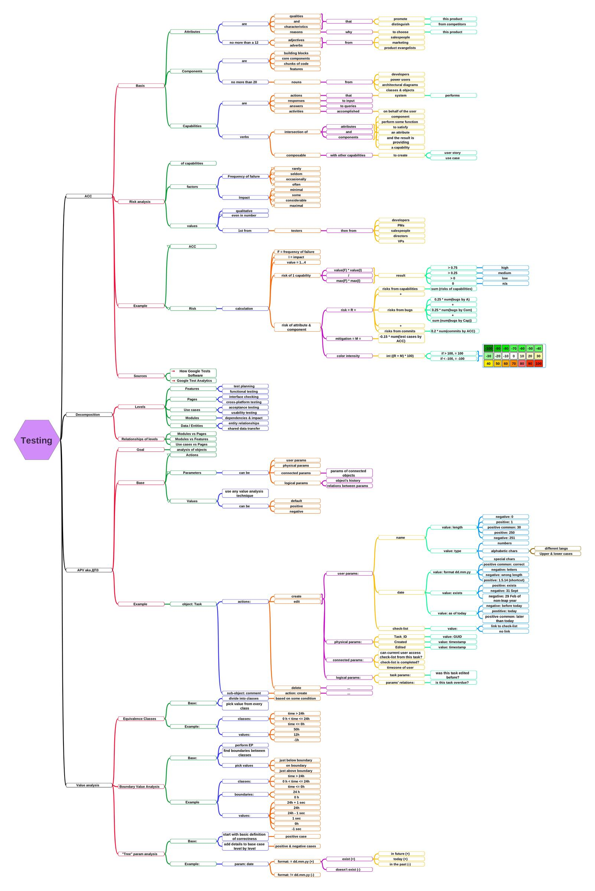

Well, it's been a while. I don't want to make so called "new year resolutions", but it's better to add a repeating task in the RTM to write something here xD

2018 started shaky. I left my first real place of work --- Quality Lab --- Alma mater of testing. This decision was heartbreaking, yet expected. On the bright side, now I have time to condition my brain into the normal mode again: for the last 1.5 year I wasn't productive in studying and reading.

First step is my mega mind map. God bless [Freeplane](https://www.freeplane.org/), it's awesome. Actually, it was a bit ugly, but now it's looking good ;) So, MMM. It's versioned with git and here is a [repo](https://github.com/aviskase/mega-mind-map). I have an impressive goal of documenting all testing techniques and approaches. Hope, I won't drop it as usual.

Here is a first iteration: 

* ACC (Attributes / Components / Capabilities)
* Decomposition
* APV aka ДПЗ (Actions / Parameters / Values)
* Value analysis

