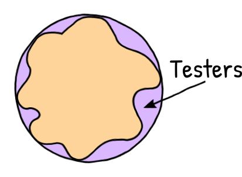

Every tester saw those articles: "Testing is dead", "Manual testing is dead", "Testing is not dead", "Automation is not testing", "Company XXX has no testers and is happy about it", etc. They might get on nerves. I love my craft, but sometimes something is nibbling at the back of my mind. Something that keeps me wondering: maybe I should move to a different role? So, I unscrambled this "something" and found an explanation why these thoughts are there and why I won't leave testing =)

Disclaimer: these thoughts are mine and I don't have a goal to promote or impose them on other people. As a normal human being I do understand that my opinion may change with new experience and knowledge. This article contains a documented reflection on my experience so far. Probably it'll be fun to read in 10-20 years (if I'll still be a tester) xD

---
## Ideal world of software development
Imagine an ideal world of software development. Scope is clear. Everything is done on time in relaxed manner without rush. Everybody is motivated to create the best product. Everybody has happy life outside of work. No stress. Users are eager to help too. And all these aren't just for one product, but true for all software in the world. Great, isn't it? 

Now, when I'm thinking about this *ideal* world, I can't find a place for testers in it. There is just no place for bugs. Developers and analysts have all the time to design and build a product without real bugs. Remember, they don't have just a time, they're also motivated, so they definitively test product. They do it themselves... so there is no need for a *separate* role of a tester.

Let's visualize this tester-less world as a perfect disk:

## Real world of software development

But our current world is not ideal. No one has enough time. Overtimes. Burning out. Problems outside work. Toxic environment. No motivation. Some rogue manager keeps adding features out of scope. And bugs, bugs everywhere. This world is distorted, some products are a bit better than others, but no one is perfect.

## Testers in the real world of software development

And that's where testers are coming. We are like clay, like sealing foam. We patch this not-ideal world. We make it less distorted.

All products are distorted in different ways, that's why you can see testers doing all kind of things. Some are just "manual monkeys." On a different extreme are those who automate test cases that are written by others. Most are somewhere in between. There are projects where testers have a hat of analytic. Or support. Or both. Or PM. Someone, maybe gurus, don't test at all: they mentor a team to test themselves, control that quality is efficiently insured by others.

Here is a fun fact. That patched version is still a lie. Testers are also not perfect. Thus, our world looks more like this:

We can't patch all holes. But we are here to try.
