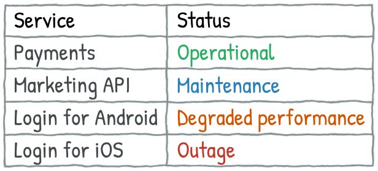

**Disclaimer:** this is a translation of [the article](https://quality-lab.ru/blog/your-api-is-your-public-face/) written 2 years ago for a corporate blog. I didn't do a word-for-word translation because the original article went through an editor, whose style was not that close to mine. Too watered down and "official." Also, some examples don't make sense in English. Still, I didn't update it too radically. Bear in mind, at the moment of the writing I was testing SOAP services and Excel-based import/export at big government project, so most of the examples relate to that experience.  


Sometimes you'll see a block like that. It will contain my current thoughts on the subject or comments.


---

First, what is API?

**API (Application Programming Interface)** is an interface which helps apps to communicate with each other. Just as a human interacts with apps via buttons and dialogs (user interface, UI), so apps interact via APIs.

## Types of API

One way to define API types is whether it's public or private API. **Private** API is used for interactions inside your system, for example:

* sync between mobile or desktop app and a server
* app uses server's computational resources (e.g., an image stylization app sends image and selected style to the server, where stylization will be done)
* communications between a web app and server
* communications between micro-services

Primary risks for private APIs are functional and performance problems. Here, customers can only speculate why app works somehow wrong-y.

With **public** API communication endpoints go beyond your system boundaries. Either you use someone's API (social networks, maps, etc.) or you provide your API to external developers.

Let's talk about public APIs a bit more. For some companies providing APIs is the core business (e.g., payment processing: Stripe, Rebilly), for others it's just a nice to have addition to the main services. Whatever the case, public APIs open a perspective into how your internal development process works. And you won't be able to hide behind fancy UI and eloquent support team.

If you publish public API with bad documentation, versioning mess, and tons of functional issues, make no mistake, external developer can (and maybe should!) assume that all your system is developed is such manner. Will they build their services around *such* system and attract new users? Nope. Will they persuade their bosses and friends against using and/or buying your product? Probably. Don't forget that people who are not so tech-y value developers' opinions a lot. And of course, those developers could also give your a bad reputation by complaining on social networks or forums. Therefore, before publishing even the tiniest API, you should think about its quality.

## Four Ways to Fuck up a Public API

There are different techniques for assessing API quality (for example, [hierarchy of needs](http://apiux.com/2013/05/29/api-hierarchy-needs/)). Let's talk about four main ways to be an awful API:

### Broken Functionality

Sounds banal, but a service should work. And it should provide functionality it was created for. On one of my projects, there was an embarrassing situation with an export. We tested API with different objects under various conditions, but only with the small number of objects. All was fine until we found a bug on export with lots of data. The thing is that the key purpose for this service was to provide an ability to do massive exports, therefore, the service didn't fulfill its main reason for existence.

You need to check available operations in context of other operations. For example, we released an import operation for objects A. It required an id of object B in the request body, but import and export of B was unreleased at the moment. As the result, it was impossible to do import A at all.

Other possible problem: do you consider a region where API will be used? Obviously, support for Cyrillic is not that important for purely US oriented product. But if you work globally, do not forget to check non-ASCII characters! Even though Unicode seems to be default, I did find bugs like that one: a user uploaded a file with the name `Документ_1.pdf`, yet it was saved as `_1.pdf`.

One more example. We had a service for chunked file download which "ate" last byte of the last chunk. It was highly critical problem because this service was a part of the system where these files were used as supporting documents for legal agreements.

### Unreliability

Service is reliable if it works when it's expected to be working and provides timely feedback in case of any problems. 

Worst performance problems I encountered were with export services. One of them was working perfectly fine until the biggest organization in the system started using it and crashing application servers. Hot-fixes after hot-fixes, optimizations, new version; nothing helped. And we couldn't disable that service or completely rewrite its public API because of contractual obligations.

So, what if your service experiences problems? How external users will learn about it? Will there be any alert about temporary issues or downtimes? Any resolution time frames? Usually, there is a special web page with answers to these question, with a table like this:

And beware, this page should not on the same infrastructure as the services it's showing! It would be quite embarrassing if [it goes down at the same time your services go down](https://twitter.com/awscloud/status/836656664635846656).

### Crappy Usability

When we hear the word "usability", we usually think about GUI: buttons and dialogs. I think GUI usability is somewhat overrated: even in the ugliest app you can guess your way by trial and error. With API it won't work:

* No public documentation? Users will never even know that API exists.
* Public documentation is there, but there is no info about actual endpoints? Users won't be able to call API.
* Public documentation is there, but written in such manner that without knowing internal docs you can't understand a thing? Again, users won't be happy at all.
* Spelling mistakes? Not that critical if in text, but can be quite awful in schemes. Real support ticket:

> Your developers drink too much and it impairs their accuracy. There is an epic fail in a scheme with the name of the element `Pressure`: the first letter is a Cyrillic character and it breaks all client code generation.


Cyrillic `Р/р`  (pronounced like "r") looks exactly like Latin `P/p`. 


* Service works fine, but error messages are not that informative? Users won't understand how to fix an error (and probably will open a support ticket, so you'll needlessly spend time resolving non-existing issue).

* You have UI and API? Don't forget to check they correspond to each other. The most common problem is when constraints on UI fields don't match same fields in API: for example, UI can accept maximum 50 characters for the name and API only 20, which leads to errors when trying to export anything created on UI.

* Don't forget about versionning (in API and its documentation). The older your services are, more careful you should be with incompatible changes. Documentation should always be up-to-date: sounds obvious, but we had a big fuck up when someone accidentally published documentation for upcoming API version and external developers started trying to use these new features, didn't find them, and bombed support team with "nothing works again" tickets.

### Security Holes

When you publish API you also increase a potential attack surface for hackers. First of all, think about authorization and authentication processes. Typically, there are special access tokens for API users. Maybe simple developers' tokens will be enough for your case, maybe you'll need to use flows like OAuth. In some cases you should sign requests and responses.

Oftentimes there are several APIs: for example, test API (for internal developers and testers) and open public API. You should make sure that test API is secured enough. There are known cases when web crawlers accidentally found test endpoints and happily showed them in search results.

If you provide access to test API to external developers, you'd better treat this API as high security risk. One time I found a stackoverflow question with code snippet containing authorization keys and proper endpoints for our system.

One open source project I used had a different issue. Test API was used by developers to help with testing: add money to the account, change account status to premium, etc. It was hidden and secure... Until someone released a version with these APIs enabled in production. That's bad :)

## Conclusion

After reading all of these, you'd think that public APIs are too risky, challenging, and expensive. Perhaps, it's better not to provide it? Maybe. But global connectivity is a trend. Stable and useful API can facilitate your profits: it can increase your user base via external apps or advertise your workplace to professionals. It's a demanding work, but it pays off.

And even if you don't and won't have public API, think about your private ones. We should care about your own developers, shouldn't we? 
