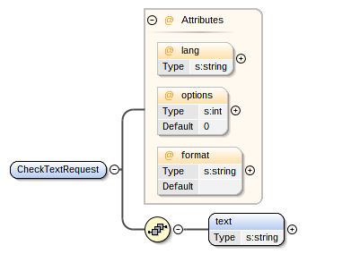

**Disclaimer:** this is a translation of [the article](https://quality-lab.ru/blog/soap-api-testing/) written 2 years ago for a corporate blog. I didn't do a word-for-word translation because the original article went through an editor, whose style was not that close to mine. Too watered down and "official." Also, some examples don't make sense in English. Still, I didn't update it too radically. Bear in mind, at the moment of the writing I was testing SOAP services and Excel-based import/export at big government project, so most of the examples relate to that experience.  


Sometimes you'll see a block like that. It will contain my current thoughts on the subject or comments.


---

SOAP (Simple Object Access Protocol) is a standardized protocol for communication between a server and a client. Typically, it's used over HTTP(S), but it can operate over other application level protocols like SMTP or FTP.

Testing SOAP services is not drastically different from any other API testing, but you need to learn some specifics and use better suited tools. This article will provide a small checklist of know-hows and skills which you can use as a guide for getting started and improving your work.

## Theory

SOAP is a protocol, so you need to read about the protocol itself as well as standards and other protocols it uses and, when the time comes, about its extensions.

### XML

XML is a markup language similar to HTML. Every message sent via SOAP is a XML-document, where you can easily identify how data are structured.

```xml
<?xml version="1.0"?>
<note>
  <to>aviskase</to>
  <from>universe</from>
  <heading>Reminder</heading>
  <body>Do not forget to translate the article!</body>
</note>
```

You can read about XML in details on [w3schools](https://www.w3schools.com/xml/default.asp). Pay attention to [namespaces](https://www.w3schools.com/xml/xml_namespaces.asp) (name conflict resolution method for XML elements), they are used in SOAP a lot.

### XSD

It's quite handy to have standardized description of possible XML-documents and to be able to validate them. For that we use XML Schema Definition (or XSD). Two key XSD features for a tester are data type definitions and an ability to restrict possible values. For instance, element `body` from the previous example can be set as optional and with a maximum string length of 255. 

```xml
...
<xs:element name="body" minOccurs="0">
  <xs:simpleType>
    <xs:restriction base="xs:string">
      <xs:maxLength value="255"/>
    </xs:restriction>
  </xs:simpleType>
</xs:element>
...
```

XSD is awesome. The more detailed it is, the fewer dumb tests you need to do. Services can use XSD to automatically validate requests and respond with a proper error. Therefore, you don't need to check all those equivalence classes and boundaries (as long as XSD is detailed and correct and this server-side validation is turned on). So, the first thing you should do for SOAP testing is to test its documentation, which is XSD. That way I found tons of issues like wrong restriction or accidental Cyrillic symbols in element definitions.

More info about XSD you can get on [w3schools](https://www.w3schools.com/xml/schema_intro.asp).

### WSDL

[WSDL](https://www.w3schools.com/xml/xml_wsdl.asp) is used for describing web services. WSDL-documents contain information about service location and available methods (operations); every operation has descriptions of request and response parameters. Sometimes XSD can be embedded inside WSDL, but that's not always the case. WSDL-document is a bit of *magic.* You can generate it from classes implementing the server and then use it to generate classes for a client. So don't forget to check that WSDL-document is accurate and accessible to users.

### SOAP

SOAP has two versions: 1.1 or 1.2. Novice tester might not bother about differences between them. Just make sure you know which version is used in your system (and sometimes it could be both). SOAP describes message formats and details for handling particular messages. For example, some header elements can be used in the services where messages are transferred between several intermediates before reaching a destination.

Here is a request example of operation `checkText` from Yandex Speller API:

```xml
<soapenv:Envelope xmlns:soapenv="http://schemas.xmlsoap.org/soap/envelope/" xmlns:spel="http://speller.yandex.net/services/spellservice">
  <soapenv:Header/>
  <soapenv:Body>
    <spel:CheckTextRequest lang="en" >
      <spel:text>mistace</spel:text>
    </spel:CheckTextRequest>
  </soapenv:Body>
</soapenv:Envelope>
```

And response:

```xml
<soap:Envelope xmlns:xsi="http://www.w3.org/2001/XMLSchema-instance" xmlns:xsd="http://www.w3.org/2001/XMLSchema" xmlns:soap="http://schemas.xmlsoap.org/soap/envelope/">
  <soap:Body>
    <CheckTextResponse xmlns="http://speller.yandex.net/services/spellservice">
      <SpellResult>
        <error code="1" pos="0" row="0" col="0" len="7">
          <word>mistace</word>
          <s>mistake</s>
        </error>
      </SpellResult>
    </CheckTextResponse>
  </soap:Body>
</soap:Envelope>
```

Read details about SOAP on [w3schools](https://www.w3schools.com/xml/xml_soap.asp).

### SOAP extensions

Occasionally you'll bump into SOAP extensions with names like `WS-`. One of the most common is [WS-Security](https://en.wikipedia.org/wiki/WS-Security) which is used for encryption and digital signatures. Often it's combined with WS-Policy for managing service access rights.

Example of WS-Security usage:

```xml
<wsse:UsernameToken wsu:Id="uuid_faf0159a-6b13-4139-a6da-cb7b4100c10c">
  <wsse:Username>Alice</wsse:Username>
  <wsse:Password Type="http://docs.oasis-open.org/wss/2004/01/oasis-200401-wss-username-token-profile-1.0#PasswordDigest">6S3P2EWNP3lQf+9VC3emNoT57oQ=</wsse:Password>
  <wsse:Nonce EncodingType="http://docs.oasis-open.org/wss/2004/01/oasis-200401-wss-soap-message-security-1.0#Base64Binary">YF6j8V/CAqi+1nRsGLRbuZhi</wsse:Nonce>
  <wsu:Created>2008-04-28T10:02:11Z</wsu:Created>
</wsse:UsernameToken>
```

Extension can be complex and intimidating. You can skip learning about them in details if your service does not have them.

## Tools

SOAP is a serious business: all this theory and standards. And XMLs tend to be *huge*. You *can,* but you *don't want* to use tools like notepad and cURL for daily work. But don't worry, there are tools to make life easier with SOAP.  

### XML&XSD editors

As I said before, you need to start testing with documentation. For that you can use special editors. Two most common are [Oxygen](https://www.oxygenxml.com/) (cross-platform) and [Altova](https://www.altova.com/) (Windows-only); both are not free. These are feature-heavy applications used by analysts.

I routinely use three features: XSD visualization, XML generation, and XML validation.

**XSD visualization** is helpful to easily spot schema elements, attributes, and restrictions. For example, `CheckTextRequest` has a required `text` element, whereas all three attributes are optional. In addition, attribute `option` has a default value `0`.



Visualization is handy when there are lots of types and restrictions. If you need only this feature and you don't want to buy apps, you can check
[free alternatives](http://stackoverflow.com/questions/2486758/how-to-visualize-an-xml-schema) like JDeveloper.

You can use **XML generation** to quickly create examples of messages based on supplied XSD. I use is for exploration and experimentation on possible XMLs and checking how restrictions are applied.

After generating messages, you can perform **XML validation** on them. Together these two features allow you to find issues with a service even when it's not yet implemented.


### Testing with SoapUI

Testing SOAP services almost always means using [SoapUI](https://www.soapui.org/). You can read about it in [this tutorial](https://www.guru99.com/webservice-testing-beginner-guide.html) or [the official documentation](https://www.soapui.org/getting-started.html). 

I've come up with eight possible levels of SoapUI mastery.

#### Level 1: sending requests

Learn how to create a project based on WSDL. SoapUI can generate all requests for you; all you need to do is to check their correctness and click a "Send" button. After getting used to send valid requests you'll need to start creating invalid ones to get expected error messages.

#### Level 2: using "Test suites" and "Test cases"

Start writing mini-autotests. Tests suites and test cases allow creating automation scenarios, prepare test data, and automatically assert responses. At first you can use them simply for organization. For example, if you filed an issue, you'd want to quickly check its fix and for that you can have a separate test suite with requests specific to each issue.

#### Level 3: writing assertions

After using cases for some time, you'll want to make them automatically asserted to mark valid responses as green and invalid ones as red. SoapUI has lots of assertion types, but the simplest ones are `Contains` and `Not Contains` which you can use to check existence of some string in the response. These assertions also support regular expressions.

#### Level 4: using XPath and/or XQuery in assertions

[XPath](https://www.w3schools.com/xml/xpath_intro.asp) is a familiar thing for those who work on UI automation with Selenium.  In short, XPath is used to search for elements inside XML-document. [XQuery](https://www.w3schools.com/xml/xquery_intro.asp) is a similar technology which can use XPath "inside"; this language is way more powerful and SQL-like. Both can be used in assertions and will make checks more robust and precise.

#### Level 5: writing complex checks with special steps

Test cases can contain several requests and other special steps, which can form a user flow (for example, a scenario "create entity → export entity"). Some of those steps are:

* `Properties` and `Property Transfer` (help to reuse data and transfer it  between requests)
* `JDBC Request` (used for getting data from databases)
* `Conditional Goto` (allows to create conditions and loops)
* `Run TestCase` (help to reuse common test cases)


#### Level 6: using Groovy scripts

SoapUI supports writing scripts in Groovy language. The simplest idea is to generate data embedding Groovy via `${=}` inside a request body. For example:

* Insert current date and time: `${=new Date().format("yyyy-MM-dd'T'HH:mm:ss")}`
* Insert a random GUID: `${=java.util.UUID.randomUUID()}` 

More complex scripts can be used in separate steps and assertions.  At some point you'll notice you tend to write everything inside script step instead of steps from level 5.


#### Level 7: using MockServices

SoapUI can generate mock objects based on WSDL. It's a crude service simulation which you can use to write and debug test cases before they are actually available for testing. Also, you can use them in place of temporarily down services.

#### Level 8: god-mode

You recognize differences between free and pro versions of SoapUI. You use SoapUI as a library from code. You use plugins and run test cases via CLI and/or CI. Your tests cases are elegant and easy to support. You know all the angles! I envy you.


Or not. Presently I don't use any GUI tools for API testing except for exploratory sessions. 
 

### Testing with code

At some point you'll have a feeling that it's more efficient to use programming languages for writing tests. That's fine. SoapUI is a GUI application and has its drawbacks; some of them are resolved with pro version, while others require huge and brittle scripting hacks. 

There are tons of libraries for working with SOAP in any language. For example, there are [Axis2](http://axis.apache.org/axis2/java/core/) for Java (good examples are in the articles at [IBM developerWorks](https://www.ibm.com/developerworks/webservices/tutorials/ws-understand-web-services1/ws-understand-web-services1.html)), [suds](https://bitbucket.org/jurko/suds/) or [zeep](http://docs.python-zeep.org/en/latest/) for Python, or [groovy-wslite](https://github.com/jwagenleitner/groovy-wslite) for Groovy.


Here is an example of request made to YandexSpeller API using groovy-wslite:

```groovy
import wslite.soap.*
def client = new SOAPClient('http://speller.yandex.net/services/spellservice?WSDL')
def response = client.send(SOAPAction: 'http://speller.yandex.net/services/spellservice/checkText') {
  body {
    CheckTextRequest('lang': 'en', 'xmlns':'http://speller.yandex.net/services/spellservice') {
      text('mistace')
    }
  }
}
assert 'mistake' == response.CheckTextResponse.SpellResult.error.s.text()
assert '1' == response.CheckTextResponse.SpellResult.error.@code.text()
```

As far as I know there are no high-level test frameworks for SOAP (similar to Rest-assured), but there is an interesting framework called [karate](https://github.com/intuit/karate) where you can describe test cases for SOAP and REST in Cucumber / Gherkin style.


I don't do any Groovy programming anymore, so no idea how groovy-wslite fares. In fact, I don't do SOAP testing now, so my knowledge about libraries can be outdated.

Plus, I avoid anything cucumber-ish =) 


---

I doubt anyone will go and test SOAP services in their free time just of curiosity. It's a heavy protocol used in serious corporate systems. But its heaviness is a good news for testing: all technologies are standardized and there is a vast ecosystem around it. 

So, here is a promised checklist. If you are only starting to test SOAP services, you need to learn and be able to use:

* XML
* XSD
* WSDL
* SOAP
* XML&XSD editors for XSD visualization
* SoapUI level 1

Basically, just standards and being able to send requests, nothing more. That's it. Of course, you'll unavoidably learn more with time, but don't deep dive right away or your head will explode =)

