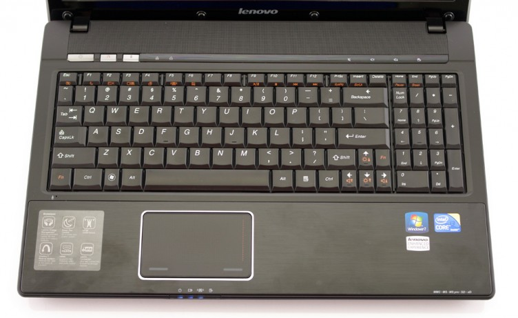
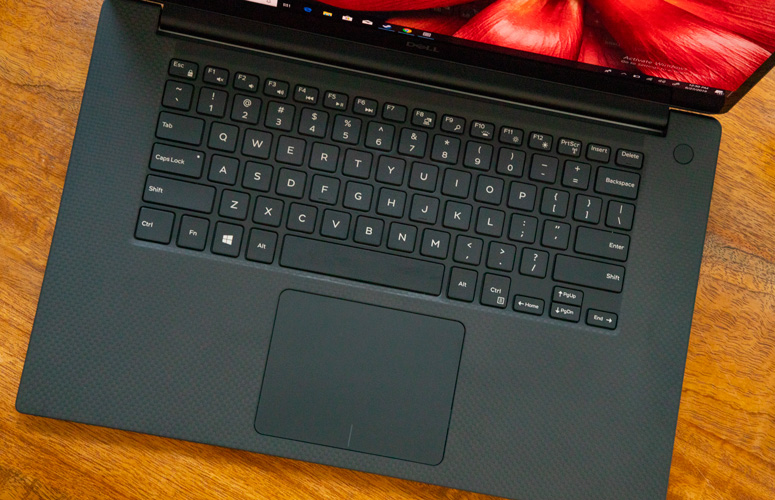

This time, the proper title would be "Weekly Arghs."

## Testing communities

When I decided to become a tester, the first-ever topic I encountered was ~~discussions~~ rants about "ISO/IEC/IEEE 29119 Software Testing" set of standards. I was fresh out of the university, so I couldn't have legal access to these documents, and naturally, I sided with opponents. Good or bad (mostly bad), I don't care: if you wish to have guidelines or standards for the profession, it must be freely accessible to everyone. The end.

But that's not the thing I want to talk about. It's just an example of my first deep dive into testing: it was a sign of what to come. Basically, everything is dividing our community: terminology, schools of thoughts, views. Dammit, testing in itself is a tiny thingy, we mostly reuse and apply knowledge and methods from other fields. Nevertheless, we keep constantly bickering with each other.

I'm not a saint either. I rant, joke, correct, discuss, persuade, and roll my eyes. Maybe it comes with the profession. Or it's a normal thing for any community. What amazes me, that this much concentration of disagreements exists around the pettiest and smallish topics. Sometimes people even talk about the same ideas but with different examples, and it results in confrontations (direct or indirect).

Giving recent cases wouldn't be humanly correct in regard to individuals involved. Let's just say: I participate in several slack workspaces. And it's quite common to a discussion in one to provoke posts in others with opposite reactions like "good work" and "it drives me insane."

Though, I want to quote one:

> Testing vs Checking is like Russian revolution --- senseless and merciless.

You can replace "testing vs checking" with whatever you want, and it will hold true to a lot of prevalent discussions.

## Laptops & Linux

I've got a new laptop: Dell XPS15 7590. My old one is a Lenovo G560, almost 9 years old. It served me well, but it's got too hard to keep even just Pycharm and Firefox running side by side. I squeezed every last bit out if it: maxing out memory to 8GB, adding SSD, using Fedora with a lighter desktop environment (XFCE). Still, its time has come.

XPS is a good choice for several reasons:

* extensible: I'll be able to add more memory (32GB), change SSD or WiFi card, add HDD (but with a smaller battery)
* Linux friendly
* good battery
* there was an awesome discount which is significant because I didn't want to go wild with work budget

But there are some disappointments. Let's start with the objective one: keyboard.

This is my old keyboard: it has Numpad, all keys, and even separate volume controls.

This is the new one:

I begrudgingly accepted not to have a Numpad and volume control keys, yet I didn't even consider that there wouldn't be separate Home, End, PgUp, and PgDn! Also, no right Fn key. Wow. What bewilders me more is that a previous model did have separate keys: but [people complained about it on the Dell forum](https://www.dell.com/community/XPS/Control-Home-Control-End-Keys/td-p/6212592). You, guys, I hate you. You're exactly like [from that XKCD comic strip](https://xkcd.com/1172/).

Next disappointment is a display. Beware, this will be unexpected... I don't like HiDPI. I'm so accustomed to shitty displays, that better ones feel wrong and uncomfortable. Colors and images are fine, but text, yikes. Letters are not crisp enough, there is something smudgy about them.

I can already hear that it's because I'm on Linux. NOPE. This laptop came with Windows 10 (I left it in a dual boot), but the text is blurry too. Even more, I think Linux actually does better jobs with antialiasing, because old Windows apps look particularly horrible.

Maybe someone will say that I should try 4k or Mac with Retina. Thanks, but no. I saw those displays too. First, I don't understand, why people keep using them without any scaling: font size is unbearably small. Second, I still don't like it.

So yeah, completely subjective feelings with physical problems: my eyes are way more strained now. Habits die hard.

Oh, and I also switched from XFCE to Gnome, and this drives me crazy even more. My first  Linux was Ubuntu with Gnome 2, and, surprisingly, UX in XFCE is closer to it than in Gnome 3. I'm too lazy to reinstall again, so, I guess, I'll try to relearn.
