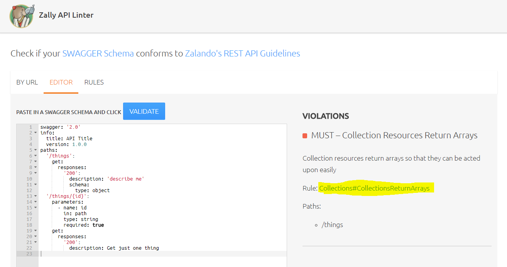

Last yearly company retrospective showed that we want to be better at knowledge sharing. One of the suggested formats is Lunch&Learn, kinda like Google's [Testing on the Toilet](https://testing.googleblog.com/2007/01/introducing-testing-on-toilet.html): short non-mandatory meeting during the lunchtime (30min) with shared recording later.

I've started to use them for API related topics. Tools, terminology, and other small but important things that would be beneficial to most of the development team (FYI, _testers are part of the dev team, duh_). Also, it's an opportunity to organize my brain, so I'll be posting notes here for future reference. One thing though, **these posts are not supposed to be comprehensive:** there is only information applicable to my team!


## Validation vs. Linting
Anyone remotely familiar with coding knows that validators and linters are important for successful development. Shortly, validators check "does X conform to the standards/specification," whereas linters complain about style and design issues. Usually, tools combine both in some way.

Here I'll cover linters for OpenAPI description documents. But you can use linting for everything, from obvious source code files to shell scripts or markdown documents.


## Why We Need a Linter for OpenAPI Description Docs

We've started writing style guidelines for our APIs. Usually, I am that nitpicky person to review description docs; but I am lazy. _I choose to automate myself out of the job._ I don't want to spend time checking for obvious style violations like capitalization or error definitions. And by the way, it would speed up the process.

Because of that, our current requirements for the linter are:

* easy to set up and run locally (so that devs and testers could use it without pain)
* can be run via Jenkins
* possible to customize with our own rules
* support for OpenAPI 2
* has a future: development is active and there is at least the possibility of OpenAPI 3 support


## Current Implicit Validation

Right now we have description docs validation during integration tests, where we use [bravado](https://github.com/Yelp/bravado) library for client generation. By default, it has some validation on doc load, and if the doc is invalid, bravado will complain. Internally it uses [swagger_spec_validator](https://github.com/Yelp/swagger_spec_validator). Here is a small script to show how it's typical _exceptional_ output looks like.

```python
import argparse
from pathlib import Path
from swagger_spec_validator import validate_spec_url


parser = argparse.ArgumentParser()
parser.add_argument(
    "openapi_spec",
    type=lambda p: Path(p).absolute().as_uri()
)
p = parser.parse_args()
validate_spec_url(p.openapi_spec)
```

```text
➜ python validate.py  api.json
Traceback (most recent call last):
  File "<...>/venv/lib/python3.7/site-packages/swagger_spec_validator/common.py", line 24, in wrapper
    return method(*args, **kwargs)
  File "<...>/venv/lib/python3.7/site-packages/swagger_spec_validator/util.py", line 60, in validate_spec_url
    validator.validate_spec(spec_json, spec_url)
  File "<...>/venv/lib/python3.7/site-packages/swagger_spec_validator/validator20.py", line 170, in validate_spec
    validate_apis(apis, bound_deref)
  File "<...>/venv/lib/python3.7/site-packages/swagger_spec_validator/validator20.py", line 376, in validate_apis
    validate_unresolvable_path_params(api_name, all_path_params)
  File "<...>/venv/lib/python3.7/site-packages/swagger_spec_validator/validator20.py", line 602, in validate_unresolvable_path_params
    raise SwaggerValidationError(msg)
swagger_spec_validator.common.SwaggerValidationError: Path parameter 'tenantID' used is not documented on '/{tenantID}/administrators/'

During handling of the above exception, another exception occurred:

Traceback (most recent call last):
  File "validate.py", line 12, in <module>
    validate_spec_url(p.openapi_spec)
  File "<...>/venv/lib/python3.7/site-packages/swagger_spec_validator/common.py", line 29, in wrapper
    sys.exc_info()[2])
  File "<...>/venv/lib/python3.7/site-packages/six.py", line 695, in reraise
    raise value.with_traceback(tb)
  File "<...>/venv/lib/python3.7/site-packages/swagger_spec_validator/common.py", line 24, in wrapper
    return method(*args, **kwargs)
  File "<...>/venv/lib/python3.7/site-packages/swagger_spec_validator/util.py", line 60, in validate_spec_url
    validator.validate_spec(spec_json, spec_url)
  File "<...>/venv/lib/python3.7/site-packages/swagger_spec_validator/validator20.py", line 170, in validate_spec
    validate_apis(apis, bound_deref)
  File "<...>/venv/lib/python3.7/site-packages/swagger_spec_validator/validator20.py", line 376, in validate_apis
    validate_unresolvable_path_params(api_name, all_path_params)
  File "<...>/venv/lib/python3.7/site-packages/swagger_spec_validator/validator20.py", line 602, in validate_unresolvable_path_params
    raise SwaggerValidationError(msg)
swagger_spec_validator.common.SwaggerValidationError: ("Path parameter 'tenantID' used is not documented on '/{tenantID}/administrators/'", SwaggerValidationError("Path parameter 'tenantID' used is not documented on '/{tenantID}/administrators/'"))
```

Also, bravado performs bits of contract testing: by default, it validates incoming responses against description docs.

It serves us nice, but feedback is slow. At least we know when our spec is blatantly broken (beloved duplication of `operationId`s).


## Zally
[Zally](https://github.com/zalando/zally) is a linter from Zalando, which is famous for its open-sourced [API guidelines](https://opensource.zalando.com/restful-api-guidelines/).

It ticks all our requirements except for the ease of setup: Zally is written in Kotlin. I was too lazy even to try running it. I'm sure it's an excellent tool, but not for us.

BTW, it has nice UI:




## Speccy
Welcome to JavaScript galore. [Speccy](https://github.com/wework/speccy) and all next linters are run using node.js. Even though I'm not a fan of JS, it's easy to use.

So, back to Speccy. It was a popular tool once, but won't work in our company:

* no support for OpenAPI 2
* is (was?) developed by WeWork. Ouch.

## IBM OpenAPI Validator
[The next candidate is from IBM](https://github.com/IBM/openapi-validator). Respectable origin.  I like how it reports problems with the exact origins of errors:

```text
➜ npx ibm-openapi-validator -e api.json
npx: installed 244 in 5.108s

errors

  Message :   PUT and POST operations must have a non-empty `consumes` field.
  Path    :   paths./{tenantID}/saml/{SAMLApplicationID}/metadata.xml.post.consumes
  Line    :   20

  Message :   operationIds must be unique
  Path    :   paths./{tenantID}/saml/{SAMLApplicationID}/metadata.xml.post.operationId
  Line    :   20

...
```

Unfortunately, it's not customizable enough. You can only tweak existing rules, change severity, or disable them.


## Spectral
And the last one, [Spectral](https://stoplight.io/p/docs/gh/stoplightio/spectral). As far as I know, a clear winner:

- core devs are also contributors to OpenAPI and JSON Schema
- the most flexible, adding new rules is easy ([examples](https://github.com/openapi-contrib/style-guides))


The one smallish problem I see is that the CLI report is not as fun as IBM's, just line numbers. 

```text
➜ npx @stoplight/spectral lint -DF error api.json
OpenAPI 2.0 (Swagger) detected

/<...>/api.json
  3972:24  error  operation-operationId-unique   Every operation must have a unique `operationId`.
  4024:24  error  operation-operationId-unique   Every operation must have a unique `operationId`.
  5029:17  error  oas2-valid-definition-example  `example` property type should be object
 11602:26  error  no-$ref-siblings               $ref cannot be placed next to any other properties

...
```

You can either use Stoplight Studio or integrate with your IDE of choice to click lazily on an error to go to its source: I did with Sublime and SublimeLinter plugin, worked fine. PyCharm (and other IDEAs) are ok too.


