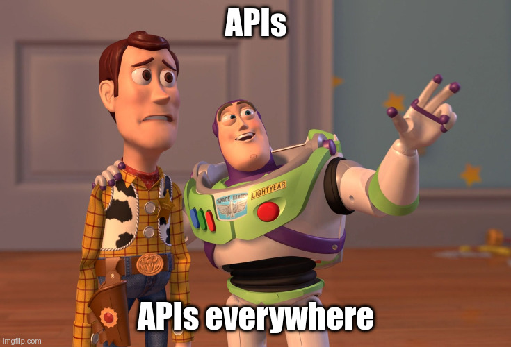

Coronavirus-free edition!

## Top X videos and readings

- Erik Wilde started a video series about API design, 
and [the last one](https://www.youtube.com/watch?v=qc_DF01qgZg) covers pros and cons of exposing system APIs.

- Tyk explains [why you shouldn't write our own API gateway](https://tyk.io/considerations-before-building-your-own-api-gateway/).
I particularly liked this part:
> Another chose to build their own API gateway because no offerings existed that would operate in their 
> preferred Windows-based server environment. 
> I haven’t heard from them since as they still haven’t shipped their product --- a full year later.

- Adidas has awesome API guidelines and recently they've published [their API training for PMs](https://github.com/adidas/api-pm-training).
If they ever decide to offer public trainings, I would love to participate: some of the modules are a bit too
business-y for me to comprehend without hands-on experience.

- Almost non-API topic. Why you should always carefully read RFCs and standards: in this case,
[what is the proper input type for numbers](https://technology.blog.gov.uk/2020/02/24/why-the-gov-uk-design-system-team-changed-the-input-type-for-numbers/).

## Testing vs DX
While I was reading [an article about DX teams](https://nordicapis.com/why-your-api-needs-a-dedicated-developer-experience-team/),
it came to me that I'm (at least partially) not a tester. I mean, I knew it, but I didn't have a proper name for that.

So, what does DX specialist do?

- API design 
- QA. Clarification: not the obvious "I'm capable of sending requests" part, but more about contract testing, linting, 
style guides, and docs.
- Tooling
- Developer relations

What's funny is that if you read that article carefully you won't find any mentions of testers.
None. There are tech writers, advocates, but no testers whatsoever. In fact, in any non-Postman induced article about API
there are no presence of testers. _And it's totally fine._

## Remote work

Sorry, it's not totally coronavirus-free edition. Almost everyone works remotely now, so there is an avalanche of 
articles about how to work from home. The company I dearly love even decided to offer _a payed_ conference (frack you).

I've started my career as a fully remote worker and was there for three years. Next two years I was working from home
at least one day a week, often more. One would say I have immense amount of tips and tricks to share, but _I don't_. 
Because I've never been accustomed to the office work in the first place. I had to learn how to work NOT from home.

All the sad things aside, it's curious how much this experience can change companies in the positive way. 
Some didn't even consider before that their work can be done remotely. Perhaps we will see a surge of remote-friendly 
and/or flexible hours positions (which are rare at the moment)?
