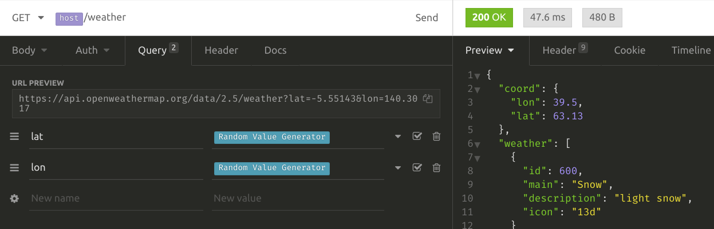

One of the tools I use almost daily is [Insomnia](https://insomnia.rest/).
It's a great alternative to the _P-everyone-knows-that-one._
Insomnia is easy to use on Linux, has plugins, and UI is clean and simple.

Let me show you some basic features. We will use [OpenWeatherMap API](https://openweathermap.org/).

## Workspaces

Workspaces are collections of thematically combined requests. Some of my workspaces are service-specific,
while others contain everything related to the particular client use case or event (i.e., cross-service).

Our first examples: get current weather and forecast for Montreal. OpenWeatherMap API requires an API key,
so you need to add it to the query parameters for each request.

## Environments
Too much duplication, isn't it?

Welcome to environments. Insomnia supports multi-layered variable assignments:

* Base environment: values are accessible regardless of which environment is selected.

* Sub environments: you can create as many as you want. Especially useful for testing APIs on different servers.

* Folder-level environment: requests can be grouped by folders and sometimes it makes sense to assign specific values
to all requests in the folder.

Ok, so for this API let's do like this. `https://api.openweathermap.org/data/2.5` can go into base,
because we have access only to one server.

An API key is perfect for the sub environment.

_"Montreal"_ is stored as a folder-level value, just for the sake of example.

Then, our requests will look like (use `{{var_name}}` to access variable):

You might notice that we still have to fill out the API key query parameter for each request. Kinda boring.
That's where plugins can help, in this case, it's `insomnia-plugin-defaults`.
Just go into _Preferences > Plugins_ and type its name to install.
This plugin allows us to set default headers and/or query parameters in the environments.

And now we can remove it from requests:

## Response querying

The response for the forecast API is big. What if we want to check all returned values for
weather descriptions? We can do it by using JSONPath response filtering.

`$.list[*].weather[*].description` means _'Get descriptions from each element of `weather`
array that is a property of elements in the `list` array'_.

## Generating values

Sometimes we want to use random values. Insomnia has embedded
[template tags](https://support.insomnia.rest/article/40-template-tags) for that, like timestamp and UUID. For other
cases plugins come to the rescue yet again: `insomnia-plugin-random` uses [Chance](https://chancejs.com/) library
which gives you tons of options.

Here is how to generate random latitude and longitude coordinates:

BTW, use  shortcut for the fastest template tag autocomplete.

## Reusing response values

Another commonly used feature is sending a request with values from the response of another request.
In Insomnia you should use `Response` template tag and JSONPath if you want to grab a value from the response body:

Pretty simple, huh?

There are other useful features and no one stops you from writing a plugin if you miss anything. But, s'il te plaît,
don't try to turn it into a complex automation solution. That's what programming languages are for.

