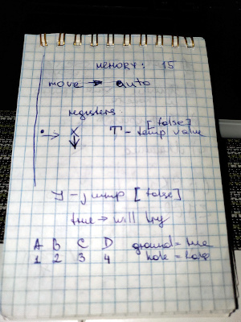
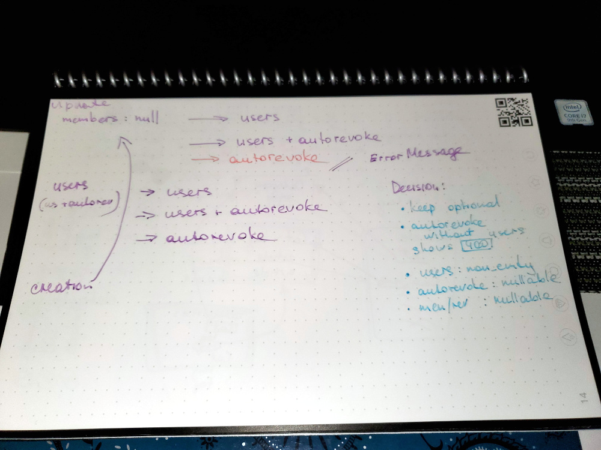
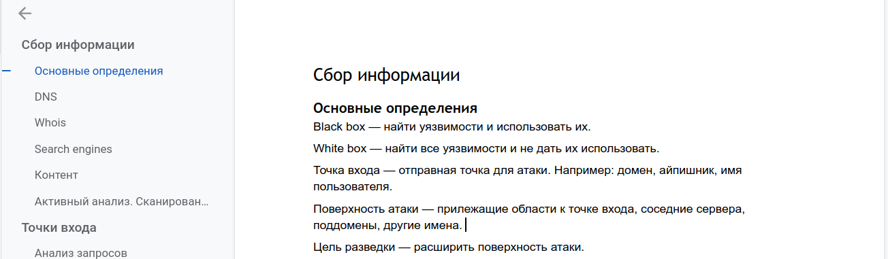
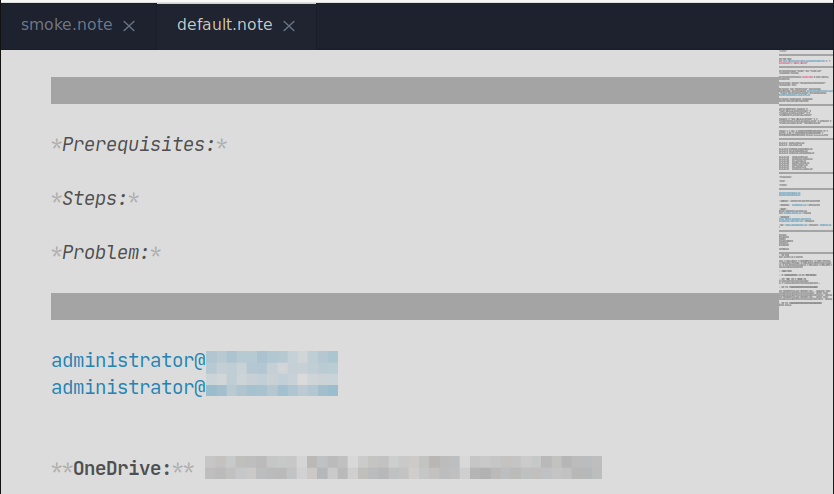
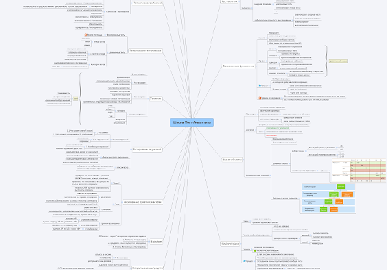
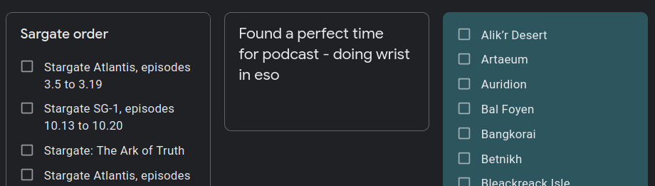

As a knowledge worker, I spend a lot of time searching and experimenting with approaches for knowledge capture and storage. Currently, I play with the new shiny app, so I figured it's a perfect moment to systemize and reflect on tools and techniques I used until now.

## Handwritten
I was more into handwriting during school and university, and there are still tons of notebooks back in Kazakhstan with course notes. I followed the same process and structure for extra studies like Coursera, and the most important thing I learned was that these notes were never ever opened and referenced later. Useless waste of stationery.

One of the last examples from English&French practice:

Don't get me wrong, I love stationery. There was a time when we visited the biggest stationery store almost every day after the classes to gawk on new cute notebooks and pens. If my handwriting wasn't that atrocious, perhaps I'd be more into bullet journals and scrapbooks, but alas, it still doesn't make them useful for anything else besides creativity outbursts.

Now I use paper only for transient scribbles consumed right away or during the day, like this problem solving for [advent of code](https://adventofcode.com/).

Though, I prefer [Rocketbook](https://getrocketbook.com/), because it's like a mini-whiteboard and I get to enjoy all fancy colors. Here is a note from API design brainstorming:

## Digital

If handwritten notes are useless, digital ones are too chaotic, because I experimented with too many formats.

### Non-structured

The first iterations were a transposition of handwritten notes into digital via _Google Docs._

They are as ineffective as the real notebooks. Type once and forget.

The direct opposite are _plain text notes_ in [Sublime](https://www.sublimetext.com/) with [PlainNotes](https://github.com/aziz/PlainNotes) plugin. I use them almost every day for:

- transient notes like "did this during the smoke test"
- common copy pastes

### Mind maps
At some point I learned about _mind mapping_ and tried almost all installable applications for that, including:

- [XMind](https://www.xmind.net/): UX is great, but features in the free tier are meh, especially in the last versions. Likes to eat memory.
- [Freeplane](https://www.freeplane.org/wiki/index.php/Home): ugly. Very ugly. Unbearably ugly. But free, fast, and has tons of features.
- [Mindomo](https://www.mindomo.com/): my latest selection, not free, yet has feature no one else has (more on that later).

As of now I have an assortment of mind maps in various formats, like [Freeplane]() or XMind:

I liked mind map for capturing phase, but for some inexplicable reason, I found them uncomfortable for referencing. They have the same fate as old course notes.

### Outliners

After that realization I discovered _outliners:_ think of them as a marriage between mind maps and bullet lists. You can follow the same tree-like structure and fold/unfold branches, yet with more capabilities for formatting and longer text.

The most well advertised outliner is [WorkFlowy](https://workflowy.com/), but I never tried it, because I'm an awful human being and prefer free stuff xD So the next best alternatives are [Dynalist](https://dynalist.io/) and [Checkvist](https://checkvist.com/). Both are fine. There are hundreds of others, some of them are open source and/or crazy and/or vim-like outliners, but as UX junkie, I used those two the most. The reasons to stop were:

- opposite of mind maps: hard to capture, easy to reference
- web-based

That's why I moved to [Mindomo](https://www.mindomo.com/), because it has a killer feature: switch between mind map and outline view.

### Notebooks

Around the same time as I discovered mind mapping, I saw the need for having long form note storage. Yeah, yeah, Evernote rules the stage. I had it, but the web version became slower and slower, and there was no Linux client, so I played with others. It's hard to remember their names though, I bet I tested more than a dozen.

For example, [Simplenote](https://simplenote.com/). Nice, but very basic.

Or extremely Chinese [WizNote](https://www.wiz.cn/).

The last one ditched just a month ago was [Joplin](https://joplinapp.org/). It's very good, I do recommend it: open source, supports markdown, has a web clipper and an Android app with WebDAV sync. If all you need is more or less suitable Evernote alternative, it's ok. Spoilers: _I needed more._

Before we go to the last section, notable mentions:

- LaTeX and RST formats: used them for a while, but Markdown is way easier and better supported.
- [OneNote](https://www.onenote.com/): I heard it's fine if you are Windows user. Well, I am not :)
- [Google Keep](https://keep.google.com/): perfect inbox for quick notes, shopping, and other lists that I need to access from the phone:

### Zettels

Ok, that's a wrong term, but it encapsulates what differs from common notebooks the best. [Zettelkasten](https://en.wikipedia.org/wiki/Zettelkasten) is a note-taking method that relies on linking. Overly simplified process is:

- create basic and the smallest possible notes (one concept per note)
- link notes with each other
- group notes thematically

There are different variations and similar methods, but all of them are based on ability to form concept maps (non-hierarchical storage). Checkout [Andy Matuschak's notes](https://notes.andymatuschak.org/About_these_notes) for example.

The most crucial part is to trace links and backlinks for each note:

- links: note A links to notes B, C, D
- backlinks: note A is linked from notes E, F, J

Usually it's easy to add links, but cumbersome to add backlinks, because as soon as you link A to B you need to open B and add a link to A. That's a wiki approach.

There are apps that simplify the process, like [Obsidian](https://obsidian.md/). It has other neat features: link visualization with a graph, note/file transclusion (aka "embedding"), and tagging.

I've started slowly migrating my non-work notes there, and it's hard. You get used to rigid hierarchies based on folders. You don't have to stop using them, but it makes sense with approaches like [@nickmilo's](https://github.com/nickmilo/IMF-v3) (which I follow loosely).

## Non-text content

Only digital:

- [Inkscape](https://inkscape.org/): my go-to drawing app since I'm better with vector graphics.
- [Krita](https://krita.org): when I learn how to draw with my graphic tablet xD
- [Excalidraw](https://excalidraw.com/): discovered via Obsidian's Discord. Will use it for graphs.
- LibreOffice Impress: not a drawing app, but for those situations when I need a presentation.
- [Shutter](https://shutter-project.org/): screenshots with annotations, more than enough for everyday usage. Or [ShareX](https://getsharex.com/) when on Windows.
- [SimpleScreenRecorder](https://www.maartenbaert.be/simplescreenrecorder/) for short screencasts. People who use GIF for that: _burn in hell._

## Summary

Let's summarize. Handwritten notes:

- use whiteboarding format (can easily "edit" by cleaning)
- transient, not for long-term storage
- for generating ideas or designs
- for small tasks during the day

One important exception is recipes. All are handwritten on small cards and stored in the box. The reason is to pull one out and stick to the fridge with a magnet. I don't have much recipes anyway, so searching and storage aren't a problem.

For digital:

- Mindomo when I _really_ want a mind map. Something tells me I won't.
- Sublime PlainNotes for transient notes and copy pastes.
- Google Keep for semi-transient lists and inbox.
- Obsidian for anything else, except overly work related (I prefer to experiment with it more on the free tier before paying for commercial license).

And for non-text content, imagine the entire section _transcluded_ here ;)

The last important bit: almost all my data is backed up in some way. Google Disk, Yandex.Drive, and OneDrive. I once lost a hard drive with my end-of-semester projects and 300GB of carefully collected music (which I never recovered). Make backups. And backup some backups.
