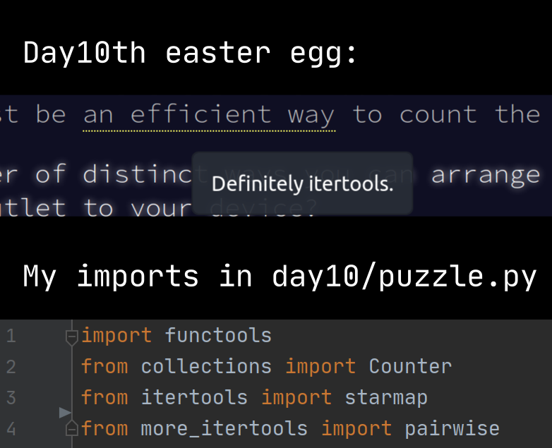

Usually it's monthly collection of things that got me ~~thinking~~ hmming. But this is the end of the year, let's do a little retrospective.

## Retro

What happened this year:

- My title switched [from "tester" to "engineer"](). Yay? 
- [Had a great time at ASC 2020 conference](). Yes, it's not my first conference, but this one left a good long-lasting aftertaste.
- I ported blog [from pelican to hugo]() and [started a redesign](). Still much to do and polish, but at least the base is sound.
- [Joined Obsidian community](). 
- As a consequence, I **unwillingly** created [a YouTube channel in Russian](). It's cool to learn new skills (audio cleaning, video editing), but to be honest, content creation in Russian isn't exactly a lucrative or professionally valuable hobby. Still, I cannot say no to people asking to teach or explain something: knowledge sharing is one of the biggest values to me.
- Finished Finnish tree on Duolingo. Don't ask why, I, person living in Quebec, learn Finnish. I just want to! *Se on täydellinen kieli*.

What didn't happen:

- [Bought a graphic tablet]() but didn't do any drawing lessons. Though, I do use it for YouTube.
- The guitar is collecting dust *again*.
- Didn't go to Kazakhstan.

2020 taught many not to make plans, good thing I never was much of the "goals" person anyway. Still, here are my themes for 2021:

- At least once be a conference speaker or [a podcast guest](). 
- Content creation: stable every other week, either this blog or Russian YouTube channel (or maybe English?). Concentrate more on tutorials.
- Guitar. Must. Be. Conquered. To make the promise more realistic, I hereby vow to start daily lessons as soon as I finish levelling [my main in ESO to CP 810]() (yup, I'm still playing it).
- Begin drawing lessons in the 2nd half of the year. Luckily, there was [a great post on Habr](https://habr.com/ru/post/534538/) about it.

You may notice almost an absence of professional goals. Typical end-of-year posts often contain promises to read more or learn new professional skills/tools. But my to-read/to-watch/to-learn queue is on the opposite side: it must be scaled down occasionally; I'm definitely not one of those people who seems to have an endless fountain of energy to do everything (aksi, talking about ya here). 

## Advent of code

This was the first time I did [Advent of code](https://adventofcode.com/) with the devs from work: nice to compare with normal people and not *reddit stars*. Cannot express how happy I'm to be [back to Python](https://github.com/aviskase/advent-of-code/tree/master/2020), it's so readable and clear after JS/TS madness. 

