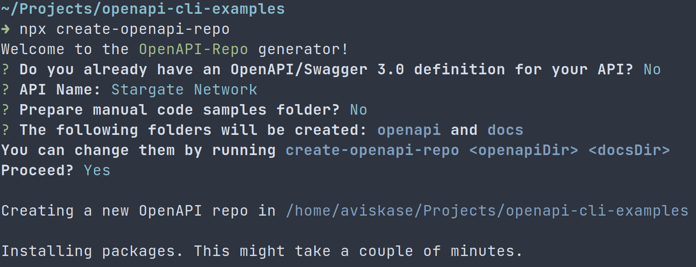
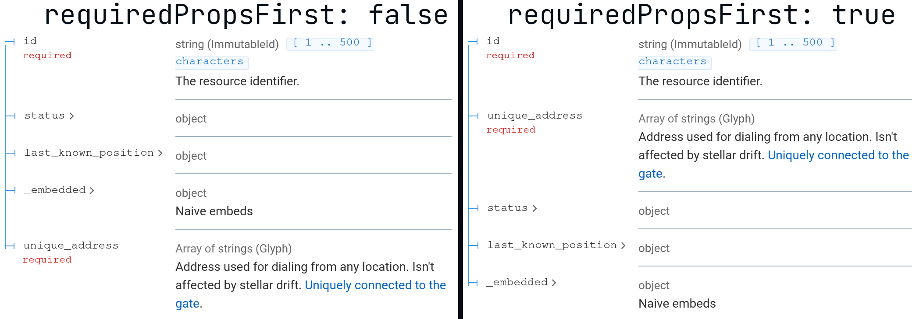

Obviously, API design is much more than writing OpenAPI description doc. First of all, should it even be OpenAPI-based? If yes, using `openapi-cli` will make your life a bit easier.

## Example API
Let's imagine you've been asked to create an API for [Stargate Network](https://stargate.fandom.com/wiki/Stargate_Network) and you already did some [preliminary analysis](https://tyk.io/api-design-methodologies/).

Stargate network consists of points in space identifiable via special addresses. When you dial an address (like a phone number), a wormhole is established between your gate and a gate at the address. Gates are physical objects, so they can be destroyed or moved to another address. 

First, resources:

- Address
	- Id
	- Is the address accessible? Can we dial it?
	- last known position in human terms (some addresses aren't fixed points in space)
	- Symbols used to dial it
		- in galaxy and out of galaxy addresses
		- unique address if it assigned to the gate 
	- Available gates at this address
- Stargate
	- Id
	- Environment: is it located above the surface, underwater, on the surface, or inside the ship?
	- State: is the gate functional, destroyed, or buried?
	- Address id

Next, operations. Nothing fancy, the bare minimum:

- List all addresses
- Get address info
- Add new gate info
- Get gate info
- Update gate info


Don't forget, not all APIs should be OpenAPI-based. If I needed to design a real Stargate system, I would go with a combo of something like GraphQL for lookup and event-based APIs for anything else (perhaps described with AsyncAPI). 
 


Let's create a place to store our OpenAPI description doc: YAML-based, multi-file git repo. You can read more about [why's in the Redocly docs](https://redoc.ly/docs/resources/openapi-decisions/).

[The example repo is on the GitHub](https://github.com/aviskase/openapi-cli-examples). At each step of the tutorial you'll see links to commits as `Commit <commit_hash>.`

## Repository structure

We're gonna use [`create-openapi-repo`](https://github.com/Redocly/create-openapi-repo) to generate the initial structure and then tweak it a bit. Run `npx create-openapi-repo` inside a directory where you want to generate API structure. One caveat to keep in mind: this tool will attempt to initialize a git repository and make a commit. [Commit e5b40a5](https://github.com/aviskase/openapi-cli-examples/tree/e5b40a5d3474eec48e236d170c15ee6faf37f631).



Let's explore the generated files:

- `docs` directory contains HTML template for reference doc. I'm deleting it, because I don't need any custom template at the moment.
- `.gitignore` set up to ignore our beloved `node_modules` and `dist` directory used for generating the final OpenAPI description doc.
- `.redocly.yaml` is a configuration file for `openapi-cli`. Because I removed `docs` directory, I also need to remove `referenceDocs.htmlTemplate` option here.
- Don't forget to update the `LICENSE`.
- `package.json` set up with the most common actions.
- Take your time to read `README.md`. It explains what actions are available and provides a sample contribution guidelines. In the real project, you probably don't want to have *all guidelines* there in one file.
- And last, but not least, `openapi` directory. This is where your API definitions live. Almost all subdirectories have a relevant `README.md` explaining why these particular files were created as well as showing you other alternatives. I don't want to copy-paste them here, so, go ahead and explore ;) 
 
Now, let's rewind the time. Stargate Network API contract is defined, [commit c2b8d11](https://github.com/aviskase/openapi-cli-examples/tree/c2b8d1172129e00903d3d1bd4cbb90f2bf03b51f). For more information about keeping your structure *DRY* read [this](https://mux.com/blog/an-adventure-in-openapi-v3-api-code-generation/) and [this](https://stoplight.io/blog/keeping-openapi-dry-and-portable/). If you're interested in reading/watching about it from me, just ping!


The definitions are not state of art, even for this shallow design. Some problems with it were added consciously to simplify the example, others for fixing in later articles. 

And I'm not even talking about how many details are omitted lore-wise! 
 

## Preview
In the `package.json` file there is already an action for previewing the docs: `openapi preview-docs`. To execute it, run in the terminal `npm run start`. 

This starts a server with the generated Redoc reference documentation ([docs](https://redoc.ly/docs/cli/commands/#preview-docs)). It watches changes from the disk; usually I keep it running while writing definitions and use it like a UI of [Stoplight Studio](https://stoplight.io/studio/) or [Insomnia Designer](https://insomnia.rest/products/designer/).

As you may (or may not) know, you can customize how Redoc looks like. This is done with`referenceDocs` section in `.redocly.yaml` ([docs](https://redoc.ly/docs/cli/configuration/reference-docs/)). Beware, some options are available only for premium edition.

Options can be divided into two categories: those that affect a theme (colors, fonts) and those for disabling or enabling certain features. For example, `requiredPropsFirst: true` will display required properties before others:



See [at commit c873f15](https://github.com/aviskase/openapi-cli-examples/tree/c873f1593825256a58991e71cc9ec968d892c3b5).

## Linting
From time to time you should lint with `openapi lint` ([docs](https://redoc.ly/docs/cli/commands/#lint)). Let's execute `npm run test`. 

```
➜ npm run test

> stargate-network@1.0.0 test /home/aviskase/Projects/openapi-cli-examples
> openapi lint

validating /home/aviskase/Projects/openapi-cli-examples/openapi/openapi.yaml...
[1] openapi/openapi.yaml:1:1 at #/

Servers must be present.

 1 | openapi: 3.0.3
 2 | info:
 … | < 30 more lines >
33 |       $ref: components/securitySchemes/api_key.yaml
34 |

Error was generated by the no-empty-servers rule.


/home/aviskase/Projects/openapi-cli-examples/openapi/openapi.yaml: validated in 27ms

❌ Validation failed with 1 error.
run with `--generate-ignore-file` to add all problems to ignore file.
```

Oops! We have an error! Wait a second, [`no-empty-servers`](https://redoc.ly/docs/cli/built-in-rules/#no-empty-servers) rule complains that we must have `servers` defined. But [OpenAPI specification doesn't state this as a required field](http://spec.openapis.org/oas/v3.0.3.html#openapi-object), so our description doc is valid. Where does this error come from?

When `.redocly.yaml` was generated, it included `lint` section:

```
lint:
  extends:
    - recommended
  rules:
    no-unused-components: warning
```

The `no-empty-servers` comes from extending recommended set of rules. If it's too strict, you may want to change to `minimal`. Or change it to `all` to get even more errors. 

I prefer keeping recommended rules and explicitly disabling unneeded ones. [Per docs](https://redoc.ly/docs/cli/configuration/lint/) you need to set `no-empty-servers: off` in `rules` section, [commit ee2e3ff](https://github.com/aviskase/openapi-cli-examples/tree/ee2e3ffb2009deefb69d75dd14febbbb90192148). Or you can change severity to `warning`.

You can read more about other built-in rules [in the docs](https://redoc.ly/docs/cli/built-in-rules/). In the later article I'll show how to add your own custom rules.

## Bundling
Most of the tools require single-file OpenAPI doc. That's where bundling comes in. The `package.json`  is preconfigured with the script to run `openapi bundle -o dist` which will save a generated file to the `dist` directory. Usually it's enough, but in some cases you may want to run with `--derefenreced` flag to produce a file with internally inlined definitions ([docs](https://redoc.ly/docs/cli/commands/#bundle)).

```
➜ npm run build

> stargate-network@1.0.0 build /home/aviskase/Projects/openapi-cli-examples
> openapi bundle -o dist

bundling /home/aviskase/Projects/openapi-cli-examples/openapi/openapi.yaml...
📦 Created a bundle for /home/aviskase/Projects/openapi-cli-examples/openapi/openapi.yaml at dist.yaml 28ms.
```

Hmm, what just happened? Instead of `./dist/<filename>.yaml` we've got `./dist.yaml`. Why?

Well, this is kinda bug or feature situation. If you [check the code](https://github.com/Redocly/openapi-cli/blob/8eeab11ca73902a0e7dcee2375981119f65eb4eb/packages/cli/src/utils.ts#L234), this looks like an intended behavior, but nevertheless confusing. In short, if you have **only one** API definition, `-o` seems to be expecting file path. If you have **multiple** API definitions (more about that in the upcoming part two), this option can point to directory.

In our example we have one API definition, so to fix we should change the script either to `-o dist/openapi` or to `-o dist/openapi.yaml`. Both will work the same, as long as `--ext` equals to `yaml` by default. If you want to generate file in JSON format, you can use `-o dist/openapi --ext json` or  `-o dist/openapi.json`. If you want both formats, you need to run commands separately, see [at commit a4e1e23](https://github.com/aviskase/openapi-cli-examples/tree/a4e1e234dc5fd11741c3f09564a8c5ee0932c098).

## Generating reference doc
One of the features that [`openapi-cli` doesn't have](https://github.com/Redocly/openapi-cli/issues/133), but I need all the time is to generate static Redoc html file. Yes, you'd want to invest in better solutions and processes at some point, but at smaller scale it's ok to send a simple HTML file when someone from non-dev team wants to see the latest or prototype API thingy. 

First, we need to install `redoc-cli` via `npm i redoc-cli`. Then, add a new script to `package.json` to generate an HTML file inside `dist` directory: 

```
"docs": "redoc-cli bundle dist/openapi.yaml -o dist/redoc.html"
```

After running `npm run docs` and opening the generated file you'll notice that all our custom options are gone. You see, `redoc-cli` doesn't support `.redocly.yaml` configuration file. To fix this, add [`prepareOptions.js`](https://github.com/aviskase/openapi-cli-examples/blob/ad6dacc3464a5800c408ce53aaa5f23bb701600a/plugins/prepareOptions.js) which reads `referenceDocs` from `.redocly.yaml` and saves it to `.redoc.json` Next, modify `docs` script to run preparation script and use `.redoc.json`:

```
"docs": "node plugins/prepareOptions.js && redoc-cli bundle dist/openapi.yaml -o dist/redoc.html --options .redoc.json"
```

See [at commit ad6dacc](https://github.com/aviskase/openapi-cli-examples/tree/ad6dacc3464a5800c408ce53aaa5f23bb701600a).

## IMHO

Personally, I prefer different names for scripts:

- `preview` instead of `start`
- `lint` instead of `test`
- `bundle` instead of `build`
- `build` for `npm run lint && npm run bundle && npm run docs`

Then, all I do is jump between `npm run preview` and `npm run build`.

See [at commit 51c078e](https://github.com/aviskase/openapi-cli-examples/tree/51c078e4913cae9f1a323e2a8be625287e343dd2).

---

That's it for today. In the [part two](), I'll show how to manage multiple definitions per repository.
