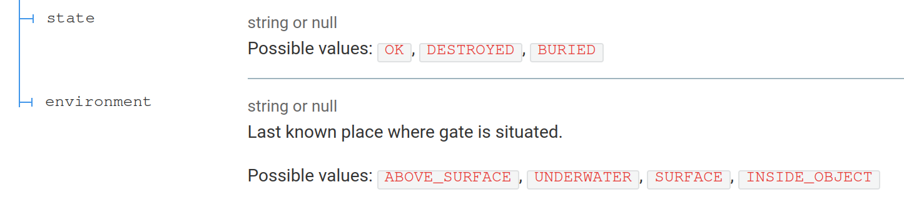

The key feature of `openapi-cli` is its extensibility. There are three ways to extend it: [preprocessors, rules, and decorators](https://redoc.ly/docs/cli/custom-rules/). In comparison, [Spectral](https://meta.stoplight.io/docs/spectral) supports only custom rules.

In this tutorial, we'll start with **preprocessors**. They are used to transform OpenAPI description document *before* validation and linting. Mind you, documentation says they should be avoided, because custom preprocessors tend to be error prone.

## Example: extensible enumerations
In our Stargate Network API there is a [`Stargate.yaml` schema](https://github.com/aviskase/openapi-cli-examples/blob/bb95d479cc184221b38ff5d5371767f0b3f32f74/openapi/components/schemas/Stargate.yaml) with two properties defined with enumerations: `state` and `environment`. We might think that we captured all potential values, but we can't be sure.

[Zalando API guidelines](https://opensource.zalando.com/restful-api-guidelines/#112) and [The Design of Web APIs by Arnaud Lauret](https://livebook.manning.com/book/the-design-of-web-apis/chapter-9/table9.1) warn us that enumerations can cause API compatibility breaks, especially with outputs. 

Imagine the scenario. We generated SDK for the initial version of the API, and the generator was smart enough to use enumerations in the selected programming language. Some time later we push a new API version where `environment` can also be `STAR`. Customers, who are still on the first version of the SDK, won't be able to process API responses containing this value, because most probably their clients will crash with something-something-uprocessable-entity exceptions.

Thus, similarly to Zalando, we will use a custom [vendor extension](https://spec.openapis.org/oas/v3.0.3.html#specification-extensions) to document possible values. I'm calling it `x-aviskase-enum` just in case not to introduce conflicts with other extensions. [Commit fa78766](https://github.com/aviskase/openapi-cli-examples/tree/fa78766d7ea2cd245740373efb951bffe7b2facf).

## Surfacing values in the documentation
Oops, now there is no way to see known values in the generated reference docs. The manual fix is to add these values to the `description`. But this is too cumbersome, especially if you'll ever want to change presentation format.

Preprocessor for the rescue! What we want it to do:

1. Find all properties with `x-aviskase-enum` property.
2. Grab the list of values, format them nicely, and add it to the `description`. Make sure not to overwrite existing description if it's already present!

### Adding a preprocessor
Let's create a preprocessor first `./plugins/preprocessors/add-enum-to-description.js`:

```js
//@ts-check
module.exports = AddEnumToDescription;

/** @type { import('@redocly/openapi-core/src/visitors').Oas3Preprocessor } */
function AddEnumToDescription(options) {
  const vendorExtension = options.vendorExtension || 'x-enum';
  return {
    Schema(schema) {
      if (schema[vendorExtension]) {
        schema.description = appendToDescription(schema[vendorExtension], schema.description);
      }
    },
  };
}

function appendToDescription(values, description) {
  let additionalDescription = `Possible values: ${values.map(v => `\`${v}\``).join(', ')}`;
  if (description) {
    return `${description}\n\n${additionalDescription}`;
  }
  return additionalDescription;
}

```

What's happening here:

- We export a preprocessor function `AddEnumToDescription` that accepts configuration `options`:
	- `vendorExtension` option is used to define extension name for extensible enumeration. If not provided, it equals to `x-enum`.
- All `openapi-cli` preprocessors should return a _visitor_. In our case, we specifically indicate to take into account only schema nodes.
- If a schema has defined extensible enumeration property, we update its description with formatted list of values.


Per documentation, for type support you can use `import('@redocly/openapi-cli').Oas3Preprocessor}`.  It never worked for me, so I use a "full path" `import('@redocly/openapi-core/src/visitors').Oas3Preprocessor`.


### Enabling our preprocessor via custom plugin
Let's keep our preprocessor (and the future ones) bundled inside one plugin via `./plugins/custom-preprocessors.js`:

```js
//@ts-check
const AddEnumToDescription = require('./preprocessors/add-enum-to-description');
const id = 'custom-preprocessors';

/** @type { import('@redocly/openapi-core/src/config/config').PreprocessorsConfig } */
const preprocessors = {
  oas3: {
    'add-x-enum-to-description': AddEnumToDescription,
  },
};

module.exports = {
  id,
  preprocessors,
};
```

Here we defined plugin's `id` and a mapping between preprocessor's name (`add-x-enum-to-description`) and its implementation.

Then we need to add this custom plugin to the `.redocly.yaml` and to enable the preprocessor:

```yaml
...
lint:
  plugins:
    - './plugins/custom-preprocessors.js'
  preprocessors:
    custom-preprocessors/add-x-enum-to-description:
      vendorExtension: x-aviskase-enum
...
```

The final result is in [commit 6654926](https://github.com/aviskase/openapi-cli-examples/tree/665492641fa119292d2ef7aa2c6bd4a87266ff9b).

## How it looks in the docs
Now, when we render a reference documentation, we can see all values with simple markdown formatting.




By the way, can you spot operations where we could have left normal `enum` and why?


## Why use a preprocessor here?
As mentioned before, preprocessors might be brittle. We could have used decorator instead. I'll show you the reason in the next article, but here is a sneak peek: we want to be able to _lint_ modified descriptions!
