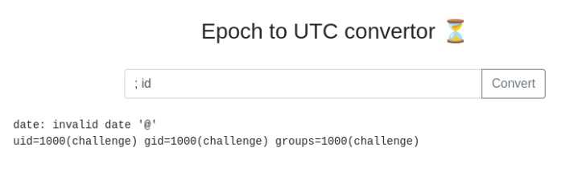
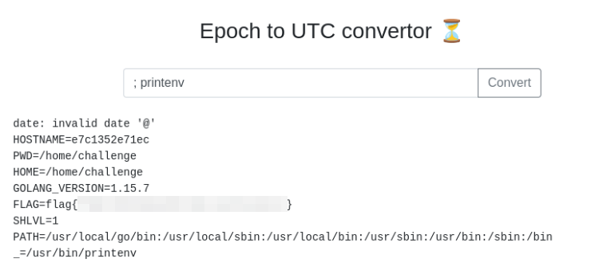

> [!info]
> - [Epoch](https://tryhackme.com/room/epoch)
> - Difficulty: easy
> - Platform: linux, web
>
> Be honest, you have always wanted an online tool that could help you convert UNIX dates and timestamps! Wait... it doesn't need to be online, you say? Are you telling me there is a command-line Linux program that can already do the same thing? Well, of course, we already knew that! Our website actually just passes your input right along to that command-line program!
>
> Check out similar content on TryHackMe: Command Injection

Quick room to test your command injection skills (as in-your-face hinted in the room description).

 

## Confirming command injection vulnerability

Machine is running a simple website which accepts timestamp via unfiltered input field and uses it in `date` command. I confirned command injection using simple semicolon:

```sh
; id
```



## Getting the flag

Getting the flag proved to be more complicated; it wasn't present at usual places. I had to check room hint:

> The developer likes to store data in environment variables, can you find anything of interest there?

Oops, that's _is_ a good place to check always! So, by changing payload to print environment variables I got the flag.

```
; printenv
```


